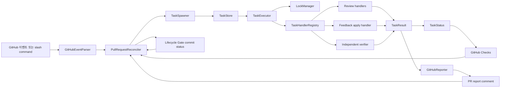
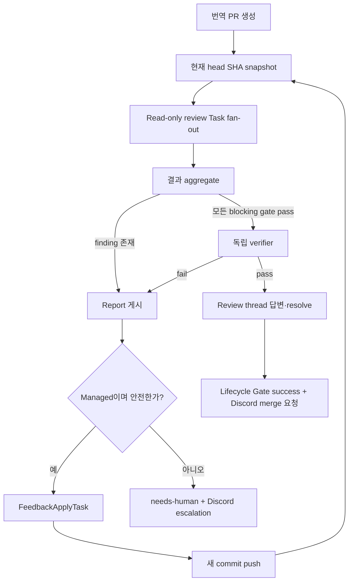

# HF 에이전트 워크플로 아키텍처

상태: 제안  
대상 저장소: `Hugging-Face-KREW/hf-workflow`, `Hugging-Face-KREW/hugging-face-krew.github.io`  
범위: 번역 PR 생성, 리뷰 게이트, 피드백 반영, 독립 검증, 머지 준비 판정

## 1. 개요

HF 에이전트 워크플로는 GitHub Pull Request를 사용자 제어 화면으로,
YAML 리소스를 워크플로 구성요소 사이의 공식 계약으로 사용한다.

이 설계는 Kelos의 `Workspace`, `AgentConfig`, `Task`, `TaskSpawner` 분리를
가져오되 Kubernetes를 요구하지 않는다. 초기 실행기는 GitHub Actions이며,
GitHub 이벤트가 Task 생성의 출발점이 된다. 개별 Task는 GitHub Checks로
표시하고, 전체 PR lifecycle은 required commit status인
`HF Agent / Lifecycle Gate`로 강제한다.

기존 번역 manifest는 계속 콘텐츠 계약으로 사용한다. 이 manifest는 원문,
번역 파일, 대상 PR, 활성화된 리뷰 skill을 설명한다. Task 실행 상태나 재시도
횟수는 manifest에 넣지 않는다.

전체 생명주기는 스케줄 기반이 아니라 이벤트 기반으로 동작한다.

```text
번역 PR 생성 또는 업데이트
  → 리뷰 Task들을 병렬 CI job으로 실행
  → 각 blocking gate가 pass 또는 fail 보고
  → 실패 내용을 PR report comment로 게시
  → 관리 대상 PR의 안전한 피드백을 mutation Task가 자동 수정
  → 사람 review thread에 근거를 답변하고 처리된 thread를 resolve
  → 새 commit이 생기면 모든 gate를 다시 실행
  → 독립 verifier가 정확히 그 head SHA를 검증
  → Lifecycle Gate가 현재 head SHA와 feedback revision에 대해 success
  → Discord webhook으로 merge 요청 알림
  → 사람이 GitHub에서 최종 확인 후 merge
```

스케줄 워크플로는 webhook 누락, stale Task, 불완전한 상태를 복구하기 위한
reconciliation fallback으로만 유지한다. 스케줄러가 주 피드백 루프가 되어서는
안 된다.

## 2. 목표

- 각 리뷰 skill을 독립된 GitHub CI check로 표시한다.
- 현재 head SHA의 모든 blocking gate가 성공하고 최신 사람 피드백까지 처리돼야
  merge-ready가 된다.
- 리뷰, 피드백 반영, 재시도, 상태 조회, 취소를 PR comment로 제어한다.
- 읽기 전용 리뷰 Task는 병렬 실행하고 PR branch mutation은 직렬화한다.
- implementer와 verifier 책임을 분리한다.
- Task, 결과, 피드백 계약을 YAML/JSON으로 명시한다.
- 모든 이벤트와 Task를 멱등적으로 처리하고 PR head SHA에 귀속시킨다.
- 자동 수정이 진전되지 않거나 예산을 초과하면 사람에게 넘긴다.
- 에이전트가 만든 번역 PR은 기본적으로 `hf-agent:managed` lifecycle로 운영한다.
- 사람의 일상적 역할은 선택적 review comment와 마지막 GitHub merge로 제한한다.
- Discord는 merge 요청과 예외 escalation을 알리는 단방향 채널로 사용한다.
- 추후 GitHub Actions를 Kelos 등 다른 실행기로 교체해도 도메인 리소스는
  유지할 수 있게 한다.

## 3. 비목표

- 범용 자율 코딩 플랫폼을 새로 만드는 것
- 사람 피드백을 기다리며 GitHub Actions runner 하나를 계속 실행하는 것
- 임의의 PR 텍스트를 실행 가능한 에이전트 지시로 취급하는 것
- 이전 commit에서 성공한 gate를 새 commit에 그대로 적용하는 것
- semantic verifier가 자신이 검증하는 candidate를 직접 수정하는 것
- YAML에 credential이나 API key 값을 기록하는 것
- 첫 버전을 위해 Kubernetes를 새로 도입하는 것
- Discord 안에서 approve, merge 또는 임의의 에이전트 명령을 실행하는 것
- gate를 우회하거나 사람 확인 없이 자동 merge하는 것

## 4. 핵심 설계 원칙

### 4.1 Desired state와 observed state를 분리한다

- 버전 관리되는 YAML은 원하는 구성을 설명한다.
- immutable Task YAML은 한 번의 실행 요청을 설명한다.
- TaskStatus와 result JSON은 실제 실행 결과를 설명한다.
- GitHub Checks는 개별 CI 실행 상태의 원본이다.
- `HF Agent / Lifecycle Gate` commit status는 branch protection이 요구하는
  최종 merge-readiness의 원본이다.
- PR comment는 사람이 읽기 위한 projection이며 유일한 상태 저장소가 아니다.

### 4.2 현재 head SHA가 검증 경계다

모든 리뷰 결과, report, 머지 판정은 candidate SHA와 feedback revision을
포함해야 한다. head SHA가 바뀌거나 새 사람 피드백이 생기면 이전 결과는
이력으로 남지만 Lifecycle Gate를 충족하지 못한다.

### 4.3 읽기 작업은 fan-out하고 mutation은 직렬화한다

SEO, 번역 품질, source fidelity, 구조 검사는 같은 immutable checkout을
대상으로 병렬 실행할 수 있다. 파일 수정이나 push가 가능한 Task는
`repository + branch` concurrency key를 사용해 한 번에 하나만 실행한다.

### 4.4 결정론적 증거를 우선한다

테스트, schema 검증, frontmatter 검증, 링크 검사, process exit code를 semantic
LLM review보다 먼저 평가한다. LLM 결과가 실패한 결정론적 check를 덮어쓸 수
없다.

### 4.5 명령과 피드백을 구분한다

자연어 리뷰 코멘트는 피드백이고, 정확한 slash command만 제어 명령이다.
피드백은 모든 리뷰어에게서 수집한다. `hf-agent:managed` PR의 low-risk 변경은
정책 자체가 mutation 권한을 부여하므로 별도 `/apply` 명령이 필요 없다. slash
command는 pause, retry, 수동 범위 지정 등 복구·운영 제어에 사용한다.

## 5. 전체 구조



### 5.1 초기 배포 구조

CI job이 번역 PR의 Checks 영역에 표시되도록 대상 publishing repo에 얇은
caller workflow를 둔다.

```text
hugging-face-krew.github.io
  .github/workflows/hf-agent-gates.yml
  .github/workflows/hf-agent-command.yml
      → Hugging-Face-KREW/hf-workflow의 reusable workflow 호출

hf-workflow
  .github/workflows/reusable-review-gates.yml
  .github/workflows/reusable-handle-command.yml
  .github/workflows/reconcile-open-prs.yml
  scripts/hf_agent/...
  resources/...
```

`hf-workflow` 저장소에서만 Actions를 실행하면 해당 job이 대상 번역 PR의
Checks 영역에 자동으로 나타나지 않는다. 대상 저장소의 caller workflow 또는
대상 head SHA에 Check Run을 생성하는 GitHub App이 필요하다. 초기 구현은 얇은
caller를 사용하고, 필요해지면 GitHub App 방식으로 전환한다.

## 6. 리소스 모델

실행 리소스 다섯 개와 기존 콘텐츠 리소스 하나를 사용한다.

| 리소스 | 책임 | 변경 특성 |
|---|---|---|
| `Workspace` | 저장소, checkout, 인증 참조, 허용 경로, 검증 명령 | 버전 관리 구성 |
| `AgentConfig` | 에이전트 adapter, 모델, prompt, skill, 권한, 실행 기본값 | 버전 관리 구성 |
| `TaskSpawner` | GitHub 이벤트·명령 필터를 Task template에 연결 | 버전 관리 구성 |
| `Task` | 특정 입력과 SHA에 대한 한 번의 실행 요청 | 생성 후 불변 |
| `TaskStatus` | phase, 시도 횟수, 시간, 출력, 실패 상태 | observed state |
| `TranslationManifest` | 원문, 번역 파일, 대상 PR, 활성 gate | 콘텐츠 계약 |

### 6.1 공통 metadata

모든 YAML 리소스는 `apiVersion`, `kind`, `metadata`, `spec`을 사용한다. 이는
이식 가능한 리소스 형식일 뿐 Kubernetes API 의존성이 아니다.

```python
from __future__ import annotations

from dataclasses import dataclass, field
from enum import StrEnum
from typing import Any, Literal, Mapping, Protocol, Sequence


@dataclass(frozen=True)
class ResourceMetadata:
    name: str
    labels: Mapping[str, str] = field(default_factory=dict)
    annotations: Mapping[str, str] = field(default_factory=dict)
```

### 6.2 Workspace

`Workspace`는 저장소 경계와 안전하게 실행할 수 있는 명령을 정의한다. token
값은 포함하지 않고 auth reference만 포함한다.

```python
@dataclass(frozen=True)
class CommandSpec:
    id: str
    argv: tuple[str, ...]
    timeout_seconds: int = 300


@dataclass(frozen=True)
class WorkspaceSpec:
    repository: str
    default_branch: str
    auth_ref: str
    allowed_paths: tuple[str, ...]
    setup_commands: tuple[CommandSpec, ...] = ()
    validation_commands: tuple[CommandSpec, ...] = ()


@dataclass(frozen=True)
class Workspace:
    api_version: str
    kind: Literal["Workspace"]
    metadata: ResourceMetadata
    spec: WorkspaceSpec
```

명령은 임의 shell 문자열보다 argument array를 우선한다. 이 방식은 quoting
오류를 줄이고 명령 allowlist를 적용하기 쉽다.

### 6.3 AgentConfig

`AgentConfig`는 worker 구현을 설정한다. 결정론적 handler는 LLM 없이
`adapter: process`를 사용하고, semantic handler는 OpenAI Responses 또는
coding-agent adapter를 사용할 수 있다.

```python
class AgentAdapter(StrEnum):
    PROCESS = "process"
    OPENAI_RESPONSES = "openai-responses"
    CODEX = "codex"


@dataclass(frozen=True)
class AgentPermissions:
    allow_file_write: bool = False
    allow_push: bool = False
    allow_comment: bool = True
    allow_issue_create: bool = False


@dataclass(frozen=True)
class AgentConfigSpec:
    adapter: AgentAdapter
    model: str = ""
    effort: str = ""
    prompt_ref: str = ""
    skills: tuple[str, ...] = ()
    permissions: AgentPermissions = AgentPermissions()
    timeout_seconds: int = 900
    max_attempts: int = 2


@dataclass(frozen=True)
class AgentConfig:
    api_version: str
    kind: Literal["AgentConfig"]
    metadata: ResourceMetadata
    spec: AgentConfigSpec
```

### 6.4 Task

`Task`는 durable execution request다. `task_kind`가 typed handler를 선택하며,
handler는 side effect를 실행하기 전에 `parameters`를 자신의 parameter class로
검증한다.

```python
class TaskKind(StrEnum):
    TRANSLATE = "translate"
    SKILL_REVIEW = "skill-review"
    FEEDBACK_TRIAGE = "feedback-triage"
    FEEDBACK_APPLY = "feedback-apply"
    INDEPENDENT_VERIFICATION = "independent-verification"
    PUBLISH_REPORT = "publish-report"
    REVIEW_THREAD_RECONCILE = "review-thread-reconcile"
    MERGE_READINESS = "merge-readiness"
    NOTIFY_DISCORD = "notify-discord"
    RECONCILE = "reconcile"


@dataclass(frozen=True)
class PullRequestRef:
    repository: str
    number: int
    branch: str
    head_sha: str


@dataclass(frozen=True)
class TriggerRef:
    delivery_id: str
    event: str
    action: str
    actor: str
    comment_id: str = ""
    comment_url: str = ""


@dataclass(frozen=True)
class ExecutionPolicy:
    concurrency_key: str
    timeout_seconds: int
    max_attempts: int
    mutation: bool
    requires_approval: bool


@dataclass(frozen=True)
class TaskSpec:
    task_kind: TaskKind
    workspace_ref: str
    agent_config_ref: str
    manifest_ref: str
    trigger: TriggerRef
    execution: ExecutionPolicy
    pull_request: PullRequestRef | None = None
    depends_on: tuple[str, ...] = ()
    parameters: Mapping[str, Any] = field(default_factory=dict)


@dataclass(frozen=True)
class Task:
    api_version: str
    kind: Literal["Task"]
    metadata: ResourceMetadata
    spec: TaskSpec
```

### 6.5 Task별 parameter class

YAML codec는 `parameters`를 mapping으로 읽고, handler registry가 실행 전에
아래 typed object 중 하나로 변환한다.

```python
@dataclass(frozen=True)
class SkillReviewParameters:
    skill_id: str
    blocking: bool = True


@dataclass(frozen=True)
class FeedbackTriageParameters:
    comment_keys: tuple[str, ...]


@dataclass(frozen=True)
class FeedbackApplyParameters:
    comment_keys: tuple[str, ...]
    expected_head_sha: str
    max_changed_lines: int = 200


@dataclass(frozen=True)
class VerificationParameters:
    candidate_sha: str
    command_ids: tuple[str, ...]
    semantic_checks: tuple[str, ...] = ()
```

### 6.6 TaskStatus와 TaskResult

```python
class TaskPhase(StrEnum):
    PENDING = "pending"
    WAITING = "waiting"
    RUNNING = "running"
    VERIFYING = "verifying"
    SUCCEEDED = "succeeded"
    FAILED = "failed"
    CANCELLED = "cancelled"
    STALE = "stale"
    NEEDS_HUMAN = "needs-human"


@dataclass(frozen=True)
class CheckResult:
    id: str
    conclusion: str
    blocking: bool
    message: str = ""
    evidence_ref: str = ""


@dataclass(frozen=True)
class TaskResult:
    schema_version: str
    task_id: str
    candidate_sha: str
    conclusion: str
    checks: tuple[CheckResult, ...] = ()
    findings: tuple[Mapping[str, Any], ...] = ()
    outputs: Mapping[str, str] = field(default_factory=dict)
    token_usage: Mapping[str, int] = field(default_factory=dict)


@dataclass
class TaskStatus:
    task_id: str
    phase: TaskPhase
    attempt: int = 0
    observed_head_sha: str = ""
    started_at: str = ""
    completed_at: str = ""
    result_commit_sha: str = ""
    result_ref: str = ""
    error: str = ""
```

### 6.7 TaskSpawner

`TaskSpawnerConfig`는 desired configuration이고, `TaskSpawner`는 이벤트를
평가해 중복되지 않은 Task를 생성하는 application service다.

```python
@dataclass(frozen=True)
class GitHubTriggerSpec:
    events: tuple[str, ...]
    actions: tuple[str, ...] = ()
    command_pattern: str = ""
    comment_on: str = ""
    minimum_permission: str = "write"
    excluded_authors: tuple[str, ...] = ()
    required_labels: tuple[str, ...] = ()
    excluded_labels: tuple[str, ...] = ()


@dataclass(frozen=True)
class TaskTemplate:
    task_kind: TaskKind
    workspace_ref: str
    agent_config_ref: str
    execution: ExecutionPolicy


@dataclass(frozen=True)
class TaskSpawnerSpec:
    trigger: GitHubTriggerSpec
    task_template: TaskTemplate
    max_concurrency: int


@dataclass(frozen=True)
class TaskSpawnerConfig:
    api_version: str
    kind: Literal["TaskSpawner"]
    metadata: ResourceMetadata
    spec: TaskSpawnerSpec
```

### 6.8 TranslationManifest

기존 manifest는 콘텐츠 리소스로 유지하고 버전을 관리한다. 다음 schema에서는
`handoff`를 `skills`로 바꾸는 것이 적절하다. 이 섹션은 runtime handoff가 아니라
활성화된 리뷰 기능을 설명하기 때문이다.

manifest에는 Task phase, retry counter, credential, GitHub delivery state를 넣지
않는다.

## 7. Python 애플리케이션 구조

### 7.1 패키지 구성

```text
scripts/hf_agent/
  domain/
    resource.py
    workspace.py
    agent_config.py
    task.py
    feedback.py
    result.py
    manifest.py

  application/
    event_parser.py
    pull_request_reconciler.py
    task_spawner.py
    task_executor.py
    lifecycle_gate.py

  handlers/
    translation.py
    skill_review.py
    feedback_triage.py
    feedback_apply.py
    independent_verifier.py
    review_thread_reconcile.py
    publish_report.py
    merge_readiness.py
    notify_discord.py

  ports/
    task_store.py
    lock_manager.py
    github_gateway.py
    reporter.py
    review_threads.py
    notifier.py
    agent_runner.py

  infrastructure/
    yaml_codec.py
    github/
      events.py
      checks.py
      comments.py
      permissions.py
    actions/
      task_store.py
      lock_manager.py
    openai/
      responses_runner.py
```

### 7.2 Port 인터페이스

```python
class TaskStore(Protocol):
    def create(self, task: Task) -> None: ...
    def get(self, task_id: str) -> Task | None: ...
    def find_by_dedupe_key(self, dedupe_key: str) -> Task | None: ...
    def history_for_pr(self, repository: str, pr_number: int) -> Sequence[TaskStatus]: ...
    def update_status(self, status: TaskStatus) -> None: ...


class LockManager(Protocol):
    def acquire(self, key: str, owner: str) -> bool: ...
    def release(self, key: str, owner: str) -> None: ...


class TaskHandler(Protocol):
    task_kind: TaskKind

    def run(self, context: "TaskContext") -> TaskResult: ...


class Reporter(Protocol):
    def task_started(self, task: Task) -> None: ...
    def task_completed(self, task: Task, result: TaskResult) -> None: ...
    def update_lifecycle_gate(
        self,
        pull_request: PullRequestRef,
        feedback_revision: str,
        state: Literal["pending", "success", "failure", "error"],
    ) -> None: ...


class ReviewThreadGateway(Protocol):
    def list(self, pull_request: PullRequestRef) -> Sequence["ReviewThread"]: ...
    def reply(self, thread_id: str, body: str) -> None: ...
    def resolve(self, thread_id: str) -> None: ...


class Notifier(Protocol):
    def merge_ready(self, pull_request: PullRequestRef, summary: str) -> None: ...
    def needs_human(self, pull_request: PullRequestRef, reason: str) -> None: ...
```

### 7.3 PullRequestReconciler

Reconciler는 event payload만 믿지 않고 최신 PR snapshot에서 필요한 작업을
계산한다. webhook은 reconciler를 깨우는 신호이며 그 자체가 전체 desired
action을 정의하지 않는다.

```python
@dataclass(frozen=True)
class PullRequestSnapshot:
    repository: str
    number: int
    branch: str
    head_sha: str
    feedback_revision: str
    draft: bool
    labels: tuple[str, ...]
    comments: tuple["FeedbackItem", ...]
    reviews: tuple["ReviewSnapshot", ...]
    review_threads: tuple["ReviewThread", ...]
    checks: tuple[CheckResult, ...]


class PullRequestReconciler:
    def plan(
        self,
        snapshot: PullRequestSnapshot,
        task_history: Sequence[TaskStatus],
    ) -> list[Task]:
        """현재 SHA에 필요한, 아직 존재하지 않는 Task만 반환한다."""
```

Reconciler의 책임은 다음과 같다.

- 이전 SHA의 Task를 stale로 판정한다.
- 누락된 required gate를 찾는다.
- PR 생성 또는 synchronize 이후 review Task를 만든다.
- 새로 추가되거나 수정된 사람 피드백에 대해 triage Task를 만든다.
- 사람 피드백 이벤트를 받으면 현재 head SHA의 Lifecycle Gate를 먼저
  `pending`으로 만들고 feedback revision을 갱신한다.
- 권한·위험 정책을 통과한 경우에만 feedback apply Task를 만든다.
- 관리 대상 PR의 안전한 피드백에는 별도 사람 명령 없이 feedback apply Task를 만든다.
- 처리되지 않은 review thread를 수집하고 reply·resolve 상태를 reconcile한다.
- mutation Task가 push한 뒤 독립 verifier를 만든다.
- 현재 SHA와 feedback revision의 모든 요구사항을 충족한 경우에만
  merge-ready로 판정한다.
- 같은 lifecycle key가 처음 merge-ready가 되었을 때 Discord 알림 Task를
  하나만 만든다.
- 반복되는 finding과 진전 없는 loop를 감지해 중단한다.

## 8. YAML 구성

```text
resources/
  workspaces/
    hf-blog-ko.yaml
  agent-configs/
    seo-reviewer.yaml
    quality-reviewer.yaml
    translation-responder.yaml
    independent-verifier.yaml
  task-spawners/
    pr-lifecycle.yaml
    pr-commands.yaml
  schemas/
    workspace.schema.json
    agent-config.schema.json
    task.schema.json
    task-spawner.schema.json

reports/
  pr-143/
    manifest.yaml
    tasks/                     # 생성 artifact이며 기본적으로 commit하지 않음
      <task-id>.yaml
      <task-id>.result.json
```

runtime Task 파일은 workflow artifact 또는 TaskStore에 저장한다. 이벤트마다
`main`에 commit하면 write contention과 재귀 workflow trigger가 생기므로 runtime
Task를 기본 브랜치에 commit하지 않는다.

### 8.1 Workspace YAML

```yaml
apiVersion: hf.krew/v1alpha1
kind: Workspace
metadata:
  name: hf-blog-ko
spec:
  repository: Hugging-Face-KREW/hugging-face-krew.github.io
  defaultBranch: main
  authRef: krew-github-app
  allowedPaths:
    - "_posts/**/*.md"
  setupCommands:
    - id: setup-python
      argv: [python3, --version]
      timeoutSeconds: 30
  validationCommands:
    - id: repository-tests
      argv: [python3, -m, pytest]
      timeoutSeconds: 600
```

### 8.2 Reviewer AgentConfig YAML

```yaml
apiVersion: hf.krew/v1alpha1
kind: AgentConfig
metadata:
  name: quality-reviewer-v1
spec:
  adapter: process
  promptRef: skills/quality/SKILL.md
  skills:
    - quality
  permissions:
    allowFileWrite: false
    allowPush: false
    allowComment: true
    allowIssueCreate: false
  timeoutSeconds: 600
  maxAttempts: 2
```

### 8.3 Feedback responder AgentConfig YAML

```yaml
apiVersion: hf.krew/v1alpha1
kind: AgentConfig
metadata:
  name: translation-responder-v1
spec:
  adapter: openai-responses
  model: gpt-5-nano
  promptRef: prompts/translation-feedback-v1.md
  skills:
    - quality
  permissions:
    allowFileWrite: true
    allowPush: true
    allowComment: true
    allowIssueCreate: false
  timeoutSeconds: 900
  maxAttempts: 2
```

### 8.4 Independent verifier AgentConfig YAML

```yaml
apiVersion: hf.krew/v1alpha1
kind: AgentConfig
metadata:
  name: independent-verifier-v1
spec:
  adapter: process
  promptRef: prompts/independent-verifier-v1.md
  skills:
    - seo
    - quality
  permissions:
    allowFileWrite: false
    allowPush: false
    allowComment: true
    allowIssueCreate: false
  timeoutSeconds: 900
  maxAttempts: 1
```

### 8.5 관리 대상 PR feedback TaskSpawner YAML

```yaml
apiVersion: hf.krew/v1alpha1
kind: TaskSpawner
metadata:
  name: apply-managed-pr-feedback
spec:
  trigger:
    events:
      - issue_comment
      - pull_request_review
    actions:
      - created
      - submitted
    commentOn: pull-request
    requiredLabels:
      - hf-agent:managed
    excludedLabels:
      - hf-agent:paused
    minimumPermission: write
    excludedAuthors:
      - github-actions[bot]
      - hf-agent[bot]
  taskTemplate:
    taskKind: feedback-apply
    workspaceRef: hf-blog-ko
    agentConfigRef: translation-responder-v1
    execution:
      concurrencyKey: "{{ repository }}/{{ branch }}"
      timeoutSeconds: 900
      maxAttempts: 2
      mutation: true
      requiresApproval: false
  maxConcurrency: 4
```

### 8.6 생성된 Task YAML

```yaml
apiVersion: hf.krew/v1alpha1
kind: Task
metadata:
  name: pr-143-feedback-apply-a1b2c3-review-12345
  labels:
    hf.krew/repository: Hugging-Face-KREW-hugging-face-krew-github-io
    hf.krew/pr: "143"
  annotations:
    hf.krew/dedupe-key: pr-143-a1b2c3-review-12345-feedback-apply-v1
spec:
  taskKind: feedback-apply
  workspaceRef: hf-blog-ko
  agentConfigRef: translation-responder-v1
  manifestRef: reports/pr-143/manifest.yaml
  pullRequest:
    repository: Hugging-Face-KREW/hugging-face-krew.github.io
    number: 143
    branch: translate/example-post
    headSha: a1b2c3
  trigger:
    deliveryId: github-delivery-id
    event: issue_comment
    action: created
    actor: maintainer-login
    commentId: "12345"
    commentUrl: https://github.com/example/repo/pull/143#issuecomment-12345
  dependsOn: []
  parameters:
    commentKeys:
      - review:98765
    expectedHeadSha: a1b2c3
    maxChangedLines: 200
  execution:
    concurrencyKey: Hugging-Face-KREW/hugging-face-krew.github.io/translate/example-post
    timeoutSeconds: 900
    maxAttempts: 2
    mutation: true
    requiresApproval: false
```

### 8.7 Discord notifier 설정

Discord webhook URL은 resource YAML에 기록하지 않고 GitHub Actions secret
`DISCORD_WEBHOOK_URL`로 주입한다. 버전 관리 설정에는 동작과 dedupe 정책만 둔다.

```yaml
notifications:
  discord:
    enabled: true
    webhookSecretRef: DISCORD_WEBHOOK_URL
    events:
      - merge-ready
      - needs-human
    dedupeKey: "{{ repository }}/{{ prNumber }}/{{ headSha }}/{{ feedbackRevision }}/{{ event }}"
    include:
      - pullRequestUrl
      - headSha
      - gateSummary
      - unresolvedThreadCount
```

## 9. Trigger 규칙

### 9.1 이벤트별 동작

| 이벤트 | 필터 | 생성할 작업 |
|---|---|---|
| `pull_request.opened` | 같은 저장소의 번역 PR, draft 아님 | manifest 보완 후 review Task fan-out |
| `pull_request.ready_for_review` | 번역 PR | 누락된 review Task fan-out |
| `pull_request.synchronize` | 새 head SHA | 이전 Task stale 처리 후 모든 required gate 재실행 |
| `pull_request.reopened` | 번역 PR | required gate 전체 reconcile |
| `pull_request_review.submitted` | 신뢰된 사람 작성자, 열린 managed PR | Lifecycle Gate pending 후 review와 inline comment triage |
| `pull_request_review.edited` | 신뢰된 작성자, body hash 변경 | Lifecycle Gate pending 후 피드백 재개방 |
| `pull_request_review_comment.created` | 신뢰된 사람 작성자 | Lifecycle Gate pending 후 새 inline comment triage |
| `pull_request_review_comment.edited` | 신뢰된 작성자, body hash 변경 | Lifecycle Gate pending 후 피드백 재개방 |
| `pull_request_review_thread.resolved` | GitHub App webhook 또는 resolver dispatch | review-thread gate 재평가 |
| `issue_comment.created` | 신뢰된 작성자의 managed PR comment | Lifecycle Gate pending 후 명령 파싱 또는 피드백 수집 |
| `issue_comment.edited` | 신뢰된 작성자, body hash 변경 | Lifecycle Gate pending 후 명령 재파싱 또는 피드백 재개방 |
| `workflow_dispatch` | 권한 있는 사용자 | 복구, 재시도, 특정 skill 실행 |
| `schedule` | 열린 번역 PR만 | 누락·stale 작업 reconcile, 정상 Task 중복 생성 금지 |

### 9.2 Slash command

```text
/hf-agent review all
/hf-agent review seo
/hf-agent review quality
/hf-agent apply all
/hf-agent apply review:98765
/hf-agent retry
/hf-agent status
/hf-agent cancel
/hf-agent rebase
```

명령 파싱 규칙:

1. 명령은 한 줄 전체를 차지하고 anchored pattern과 일치해야 한다.
2. mutation 명령은 repository `write` 이상의 권한을 요구한다.
3. bot 작성자와 agent marker comment는 제외한다.
4. command ID는 comment ID, body hash, 현재 head SHA로 구성한다.
5. comment를 수정했을 때 body hash가 달라진 경우에만 새 버전으로 처리한다.
6. 이미 끝난 mutation은 command comment 삭제로 rollback하지 않는다.
7. 알 수 없는 명령은 help를 응답하고 Task를 만들지 않는다.

정상적인 managed PR loop는 `/hf-agent apply`를 요구하지 않는다. 이 명령은
`paused` 상태의 수동 복구, 자동 분류가 보류한 항목의 명시적 재처리, 운영자
진단을 위해 남긴다.

### 9.3 Managed PR 자동 처리 정책

에이전트가 생성한 번역 PR에는 기본적으로 `hf-agent:managed` label을 붙인다.
사람 피드백은 먼저 read-only triage하고, 아래 조건을 모두 만족하면 별도
승인 명령 없이 mutation한다.

- PR에 `hf-agent:managed`가 있고 `hf-agent:paused`가 없다.
- 피드백 작성자가 repository `write` 권한 이상이거나 명시적 trusted-reviewer
  allowlist에 있다.
- triage 결과가 actionable이고 low risk다.
- 변경 대상이 Workspace allowlist 안에 있다.
- expected head SHA가 여전히 현재 SHA와 같다.
- PR이 autonomous repair 제한을 넘지 않았다.

조건을 충족하지 않으면 자동 수정하지 않고 `hf-agent:needs-human`을 붙인 뒤
근거를 PR에 보고하고 Discord로 escalation한다. 사람이 방향을 comment로
명확히 하면 같은 이벤트 loop가 다시 triage한다.

label 의미는 다음과 같다.

- `hf-agent:managed`: 기본 자동 lifecycle 적용
- `hf-agent:paused`: mutation과 자동 resolve 중지, read-only gate만 허용
- `hf-agent:needs-human`: 모호함, 충돌, 고위험 변경 또는 반복 실패

## 10. Review gate와 GitHub Actions

### 10.1 PR에 표시할 check

```text
HF Agent / SEO
HF Agent / Quality
HF Agent / Source Fidelity
HF Agent / Structure
HF Agent / Feedback Addressed
HF Agent / Review Threads Resolved
HF Agent / Independent Verifier
HF Agent / Publish Report
HF Agent / Finalize Lifecycle
HF Agent / Lifecycle Gate        # commit status
```

개별 skill job은 가시성을 제공한다. Branch protection에는 안정적인 commit
status context인 `HF Agent / Lifecycle Gate`만 HF Agent required status로
등록한다. Actions job이 완료된 뒤 같은 SHA에 코멘트만 추가돼도 최신 commit
status를 `pending`으로 덮어써 merge를 다시 막을 수 있기 때문이다. 개별 skill
추가·삭제 때마다 저장소 rule을 수정할 필요도 없다.

기존 저장소의 build/test check는 별도 required check로 유지한다.

### 10.2 대상 저장소 caller workflow

```yaml
name: HF Agent Gates

on:
  pull_request:
    types: [opened, reopened, ready_for_review, synchronize]
  merge_group:
  workflow_dispatch:

permissions:
  contents: read
  pull-requests: write
  checks: write
  statuses: write

concurrency:
  group: hf-agent-gates-${{ github.event.pull_request.number || github.ref }}
  cancel-in-progress: true

jobs:
  gates:
    uses: Hugging-Face-KREW/hf-workflow/.github/workflows/reusable-review-gates.yml@<pinned-sha>
    with:
      pr_number: ${{ github.event.pull_request.number }}
      head_sha: ${{ github.event.pull_request.head.sha }}
    secrets: inherit
```

운영 환경의 caller는 reusable workflow를 검토된 commit SHA에 pin한다. 추후
bot이 pinned SHA 업데이트 PR을 만들 수 있다.

write credential을 보유한 상태에서 PR 코드를 checkout하고 실행하는
`pull_request_target`은 사용하지 않는다. 번역 PR은 같은 저장소 branch에서
생성하고 mutation에는 최소 권한 GitHub App token을 사용한다.

### 10.3 Reusable review workflow

```yaml
name: Reusable HF Agent Review Gates

on:
  workflow_call:
    inputs:
      pr_number:
        required: true
        type: number
      head_sha:
        required: true
        type: string

jobs:
  review:
    name: HF Agent / ${{ matrix.skill }}
    strategy:
      fail-fast: false
      matrix:
        skill: [seo, quality, source-fidelity, structure, feedback-addressed]
    runs-on: ubuntu-latest
    steps:
      - name: Run skill task
        run: python3 scripts/hf_agent/run_task.py --kind skill-review --skill "${{ matrix.skill }}"
      - name: Upload task result
        if: ${{ always() }}
        uses: actions/upload-artifact@v4
        with:
          name: gate-${{ matrix.skill }}-${{ inputs.head_sha }}
          path: outputs/${{ matrix.skill }}-result.json

  review_threads:
    name: HF Agent / Review Threads Resolved
    runs-on: ubuntu-latest
    steps:
      - name: Fail when an inline review thread is unresolved
        run: >-
          python3 scripts/hf_agent/run_task.py
          --kind review-thread-reconcile
          --mode check-only
          --pr "${{ inputs.pr_number }}"
          --head-sha "${{ inputs.head_sha }}"

  verifier:
    name: HF Agent / Independent Verifier
    needs: review
    if: ${{ needs.review.result == 'success' }}
    runs-on: ubuntu-latest
    steps:
      - name: Verify exact candidate SHA in a fresh checkout
        run: >-
          python3 scripts/hf_agent/run_task.py
          --kind independent-verification
          --head-sha "${{ inputs.head_sha }}"

  report:
    name: HF Agent / Publish Report
    if: ${{ always() }}
    needs: [review, review_threads, verifier]
    runs-on: ubuntu-latest
    steps:
      - name: Download results
        uses: actions/download-artifact@v4
      - name: Publish marker-based report comment
        run: python3 scripts/hf_agent/publish_report.py

  finalize_lifecycle:
    name: HF Agent / Finalize Lifecycle
    if: ${{ always() }}
    needs: [review, review_threads, verifier, report]
    runs-on: ubuntu-latest
    steps:
      - name: Re-read PR and publish canonical lifecycle status
        env:
          REVIEW_RESULT: ${{ needs.review.result }}
          THREAD_RESULT: ${{ needs.review_threads.result }}
          VERIFIER_RESULT: ${{ needs.verifier.result }}
          REPORT_RESULT: ${{ needs.report.result }}
        run: >-
          python3 scripts/hf_agent/finalize_lifecycle.py
          --pr "${{ inputs.pr_number }}"
          --expected-head-sha "${{ inputs.head_sha }}"

  notify-merge-ready:
    name: HF Agent / Notify Merge Ready
    needs: finalize_lifecycle
    if: ${{ needs.finalize_lifecycle.result == 'success' }}
    runs-on: ubuntu-latest
    steps:
      - name: Send deduplicated Discord webhook
        env:
          DISCORD_WEBHOOK_URL: ${{ secrets.DISCORD_WEBHOOK_URL }}
        run: >-
          python3 scripts/hf_agent/notify_discord.py
          --event merge-ready
          --pr "${{ inputs.pr_number }}"
          --head-sha "${{ inputs.head_sha }}"
```

`fail-fast: false`를 사용하면 하나의 gate가 실패해도 모든 리뷰 증거를 수집할
수 있다. artifact upload와 report publication은 `always()`를 사용해 실패
출력을 보존한다. finalizer도 `always()`를 사용하고, dependency 결과와 최신 PR
snapshot을 함께 평가해 Lifecycle Gate를 `success`, `failure` 또는 `pending`으로
게시한다.

### 10.4 Ready 이후 사람 피드백 처리

완료된 Actions job 자체는 새 코멘트로 자동 무효화되지 않는다. 따라서 managed
PR의 사람 피드백 이벤트를 받는 entrypoint는 webhook과 PR 상태를 검증하고,
작성자가 repository `write` 권한 이상 또는 trusted-reviewer allowlist인지 확인한
직후, 어떤 agent Task보다 먼저 현재 PR head SHA에 다음 commit status를
생성한다.

```json
{
  "state": "pending",
  "context": "HF Agent / Lifecycle Gate",
  "description": "New feedback is being processed"
}
```

사용할 이벤트는 다음과 같다.

```yaml
on:
  issue_comment:
    types: [created, edited]
  pull_request_review:
    types: [submitted, edited]
  pull_request_review_comment:
    types: [created, edited]

permissions:
  contents: read
  pull-requests: write
  statuses: write
```

리뷰·코멘트 이벤트의 `GITHUB_SHA`는 PR head SHA가 아닐 수 있다. entrypoint는
payload 또는 Pull Request API에서 `pull_request.head.sha`를 다시 조회하고 그
SHA에 status를 게시한다. bot marker, 신뢰되지 않은 작성자, 닫히거나 merge된
PR은 status를 pending으로 바꾸거나 mutation Task를 만드는 대상에서 제외한다.

같은 SHA에도 새 코멘트가 추가될 수 있으므로 lifecycle identity는 다음과 같다.

```text
lifecycle key = repository + PR + head_sha + feedback_revision

feedback_revision = hash(
  sorted(comment_id + updated_at + body_hash + resolution_state)
)
```

Task 시작 snapshot은 Task/result artifact에 보존한다. finalizer는 그 snapshot과
완료 직전 최신 snapshot을 비교한다. head
SHA 또는 feedback revision이 다르면 `success`를 게시하지 않고 새 revision을
reconcile한다. 최신 snapshot의 모든 gate, verifier, feedback disposition,
review thread가 충족된 경우에만 Lifecycle Gate를 `success`로 만든다.

```python
before = load_task_snapshot_artifact(task_id)
after = load_snapshot(pr_number)

if after.lifecycle_key != before.lifecycle_key:
    return reconcile(after)
if not readiness_policy.allows(after):
    return publish_lifecycle_status(after, "failure")
return publish_lifecycle_status(after, "success")
```

finalizer는 Lifecycle Gate가 실제 `success`일 때만 exit code 0을 반환한다.
`pending`, `failure`, `error`를 게시한 경우 notifier job이 실행되지 않도록 non-zero
또는 구조화된 job output으로 분기한다.

MVP는 GitHub Commit Status API를 사용한다. 더 풍부한 annotation과 requested
action이 필요해지면 동일한 `LifecycleGatePublisher` port 뒤를 GitHub App
Check Run 구현으로 교체한다.

### 10.5 재실행 규칙

| 상황 | 재실행 방식 |
|---|---|
| 같은 SHA, transient failure, 파일 변경 없음 | 실패한 job 또는 지정 skill만 재실행 |
| 같은 SHA, 외부 evaluator 상태 변경, 파일 변경 없음 | 해당 job과 Lifecycle Gate 재평가 |
| FeedbackApplyTask가 새 commit push | 새 SHA에서 모든 required gate 재실행 |
| base branch 변경 및 strict up-to-date 정책 | rebase/update 후 모든 gate 재실행 |
| skill 또는 prompt 설정 변경 | 관련 gate 재실행 후 현재 정책 전체 충족 확인 |

이전 SHA의 결과는 새 SHA를 merge-ready로 만들 수 없다.

## 11. 피드백 모델

### 11.1 FeedbackItem

```python
class FeedbackDisposition(StrEnum):
    NEW = "new"
    EDITED = "edited"
    ACTIONABLE = "actionable"
    IGNORED = "ignored"
    NEEDS_HUMAN = "needs-human"
    APPLIED = "applied"
    NO_CHANGES = "no-changes"


@dataclass(frozen=True)
class FeedbackItem:
    key: str
    kind: str
    comment_id: str
    author: str
    body: str
    body_hash: str
    updated_at: str
    path: str = ""
    line: int | None = None
```

각 feedback item별 disposition을 기록한다. 일부 diff가 생겼다는 이유로 입력
피드백 전체를 `applied` 처리해서는 안 된다. 모호한 피드백은 `needs-human`,
실제 변경이 없는 경우에는 이유와 함께 `no-changes`로 기록한다.

### 11.2 Feedback apply 결과

Responder는 patch와 함께 feedback별 처리 결과를 구조화해 반환한다.

```json
{
  "candidate_sha_before": "a1b2c3",
  "feedback": [
    {
      "key": "review:98765",
      "disposition": "applied",
      "changed_paths": ["_posts/example.md"],
      "summary": "요청된 문단의 용어를 수정함"
    }
  ]
}
```

Mutation handler는 commit 전에 path allowlist, frontmatter, 보호 블록, diff
크기, expected head SHA를 검증한다.

### 11.3 Review thread 모델과 resolve 규칙

GitHub inline review thread는 일반 Conversation comment와 구분해 모델링한다.

```python
@dataclass(frozen=True)
class ReviewThread:
    id: str
    is_resolved: bool
    is_outdated: bool
    path: str
    line: int | None
    comments: tuple[FeedbackItem, ...]
```

현재 PR의 thread는 GitHub GraphQL `PullRequest.reviewThreads`로 조회하고,
처리가 끝난 inline thread만 `resolveReviewThread(threadId)` mutation으로
resolve한다. 일반 issue/Conversation comment에는 resolve 개념이 없다.

처리 순서는 다음과 같다.

1. 반영하는 피드백은 수정·검증·push 후 commit과 근거를 thread에 답변한다.
2. 현재 head에 반영됐음을 확인한 뒤 thread를 resolve한다.
3. 이미 반영됨, 중복, 무관함, 별도 이슈로 분리됨처럼 객관적인 disposition은
   이유를 답변한 뒤 resolve할 수 있다.
4. 모호함, 상충 지시, 고위험 변경은 unresolved로 유지하고
   `hf-agent:needs-human`으로 전환한다.
5. `HF Agent / Review Threads Resolved`는 unresolved thread가 하나라도 있으면
   fail한다.

thread resolve와 review 상태는 별개다. `CHANGES_REQUESTED` review를 에이전트가
임의 dismiss하지 않으며, 저장소의 사람 approval/requested-changes 정책은
branch protection이 별도로 강제한다. GitHub Actions-only MVP에서는 에이전트가
thread를 resolve한 직후 `workflow_dispatch`로 gate reconciliation을 요청한다.

## 12. 독립 verifier

Verifier는 정확한 candidate SHA를 fresh checkout한 별도 Task다. implementer의
숨은 reasoning을 전달받지 않고 write/push 권한도 갖지 않는다.

```text
FeedbackApplyTask
  → candidate SHA commit
  → IndependentVerificationTask가 apply Task에 dependsOn
  → 결정론적 check
  → 선택적 semantic check
  → PASS 또는 구조화된 FAIL
```

Verifier는 candidate를 직접 고치지 않는다. 실패하면 finding을 새 implementer
Task에 전달하거나 사람에게 넘긴다. 이 방식으로 maker/checker 분리를 유지한다.

```json
{
  "schema_version": "hf.verification.result.v1",
  "task_id": "verify-pr-143-a1b2c3",
  "candidate_sha": "a1b2c3",
  "conclusion": "fail",
  "checks": [
    {
      "id": "frontmatter",
      "type": "deterministic",
      "exit_code": 0
    },
    {
      "id": "feedback-addressed",
      "type": "semantic",
      "conclusion": "fail"
    }
  ],
  "findings": []
}
```

## 13. Loop 설계

### 13.1 최초 PR 리뷰 loop



### 13.2 사람 피드백 loop

```text
사람이 review feedback을 추가 또는 수정
  → 이벤트가 reconciler 실행
  → FeedbackTriageTask가 항목별 분류
  → managed PR의 low-risk 항목은 자동 FeedbackApplyTask 생성
  → FeedbackApplyTask가 현재 head 수정
  → 결정론적 pre-push 검증
  → commit/push
  → pull_request.synchronize가 새 SHA의 전체 review loop 실행
```

### 13.3 같은 SHA의 실패 gate 재실행 loop

```text
transient 오류 또는 evaluator 문제로 gate 실패
  → /hf-agent retry <skill> 또는 GitHub failed-job rerun
  → 같은 SHA에 대해 실패 skill만 재실행
  → 해당 report 갱신
  → 그 lifecycle key의 Lifecycle Gate 재평가
```

파일이 하나라도 변경된 후에는 이 경로를 사용하지 않는다.

### 13.4 자동 repair loop

```text
review fail
  → low-risk feedback 반영
  → push
  → 전체 review
  → independent verification
  → ready 또는 제한 내에서 반복
```

다음 조건 중 하나를 만나면 loop를 중단하고 `needs-human`으로 전환한다.

- 한 PR lifecycle에서 자동 mutation 3회 초과
- 수정 시도 후 동일한 normalized finding hash가 두 번 등장
- actionable feedback인데 responder가 diff를 만들지 못함
- 요청 변경이 changed-line 또는 path budget 초과
- 리뷰어 지시가 서로 충돌
- 보호 구조 또는 허용되지 않은 path 변경 필요
- mutation 실행 중 head SHA 변경
- 필수 외부 dependency가 재시도 후에도 불가

### 13.5 Reconciliation loop

스케줄 fallback은 무조건적인 rewrite를 수행하지 않는다.

1. 열린 번역 PR을 조회한다.
2. 현재 SHA, checks, comments, task marker를 수집한다.
3. 이전 SHA의 작업을 stale 처리한다.
4. reconciler 판단에 따라 누락된 Task만 만든다.
5. deadline을 넘긴 stuck Task를 감지한다.
6. desired state와 observed state가 일치하면 아무 작업 없이 종료한다.

## 14. Merge readiness

`HF Agent / Lifecycle Gate`는 아래 조건이 모두 현재 head SHA와 feedback
revision에 대해 만족될 때만 성공한다.

- 활성화된 모든 blocking review gate가 pass
- 독립 verifier가 pass
- pending actionable feedback가 없음
- unresolved inline review thread가 0개
- unresolved `needs-human` feedback가 없음
- report publication 성공
- verification 이후 PR head가 변경되지 않음
- task 시작 이후 feedback revision이 변경되지 않음

저장소 규칙은 추가로 다음을 요구할 수 있다.

- 사람 approval
- requested changes 없음
- GitHub native “Require conversation resolution before merging” 활성화
- merge conflict 없음
- 최신 base branch 반영 또는 merge queue 검증
- HF agent와 무관한 기존 repository CI 통과

Merge-ready PR comment는 선택 사항이다. 실제 강제 수단은 branch protection과
required `HF Agent / Lifecycle Gate` commit status다.

## 15. 멱등성, 동시성, stale 작업

### 15.1 Key 정의

```text
event key       = repository + delivery_id
command key     = repository + comment_id + body_hash
review task key = repository + PR + head_sha + skill_id + skill_version
mutation key    = repository + PR + head_sha + feedback_hash + prompt_version
lifecycle key   = repository + PR + head_sha + feedback_revision
lock key        = repository + branch
```

### 15.2 동시성 규칙

- 서로 다른 PR branch의 mutation은 병렬 실행할 수 있다.
- 동일 branch에는 mutation Task가 최대 하나만 존재한다.
- read-only Task는 immutable SHA에 대해 병렬 실행할 수 있다.
- 새 PR head가 생기면 이전 head의 read-only 작업을 cancel 또는 stale 처리한다.
- GitHub Actions `concurrency`는 coarse lock으로, `LockManager`는 application
  invariant로 같은 규칙을 적용한다.

### 15.3 Stale Task 처리

모든 mutation handler는 write 전에 PR head를 다시 조회한다. 값이
`expected_head_sha`와 다르면 write, commit, feedback applied 처리를 하지 않고
`stale`을 반환한다.

Lifecycle finalizer는 success 게시 직전에 head SHA뿐 아니라 feedback revision도
다시 조회한다. 둘 중 하나가 예상 값과 다르면 이전 실행 결과로 green을 만들지
않는다.

## 16. Report와 상태 저장

### 16.1 관심사별 source of truth

| 관심사 | 초기 source |
|---|---|
| Desired resource 구성 | `hf-workflow`의 버전 관리 YAML |
| 번역 콘텐츠 계약 | `reports/pr-<n>/manifest.yaml` |
| Native CI 실행 상태 | 대상 SHA의 GitHub Actions run과 Checks |
| 최종 merge-readiness | `HF Agent / Lifecycle Gate` commit status |
| Machine result evidence | Task ID와 SHA로 식별되는 JSON workflow artifact |
| 사람용 결과 | Marker 기반 PR report comment |
| 피드백 입력 | GitHub issue/review comments |
| Dedupe·reconciliation view | GitHub Checks/statuses, marker metadata, TaskStore adapter |

MVP에서는 `GitHubTaskStore`가 Actions run, Checks, marker comment에서 상태를
구성하고 Task/result 문서는 artifact로 업로드한다. Artifact 보존 기간이
부족해지면 handler 변경 없이 TaskStore를 object storage나 DB로 바꾼다.

### 16.2 Report comment 예시

```markdown
<!-- hf-agent-report repo=... pr=143 head=a1b2c3 -->

## HF Agent 리뷰

| Gate | 결과 | 요약 |
|---|---|---|
| SEO | ✅ Pass | 필수 SEO check 통과 |
| Quality | ❌ Fail | Actionable finding 2개 |
| Source Fidelity | ✅ Pass | 원문 구조 보존 |
| Feedback Addressed | ✅ Pass | 선택한 피드백 전체 매핑 |

Head SHA: `a1b2c3`
```

호환성을 위해 report에 hidden machine-readable block을 포함할 수 있지만,
merge 가능 여부는 현재 lifecycle key에 대응하는 required Lifecycle Gate status로
결정한다.

### 16.3 Discord merge 요청 MVP

Discord webhook은 단방향 알림만 전송한다. `HF Agent / Lifecycle Gate`가 현재
lifecycle key에서 처음 success가 되면 다음 정보를 보낸다.

- PR 제목과 GitHub URL
- repository, PR 번호, 검증된 head SHA
- blocking gate 요약과 unresolved review thread 수
- “GitHub에서 최종 확인 후 merge” 안내

알림 dedupe key는 `repository + PR + head_sha + feedback_revision + merge-ready`다.
처리할 내용이 없는 코멘트 재전송은 막고, 새 수정 commit 또는 새 actionable
feedback revision이 수렴한 경우에만 새 알림을 보낸다. `needs-human` 전환은
별도의 escalation 알림으로 보낼 수 있다.

Discord 버튼, interaction endpoint, Discord 안에서의 approve/merge, 자동
merge는 MVP 범위에서 제외한다. 최종 승인 행위는 GitHub의 사람 merge이며,
branch protection을 우회하지 않는다.

## 17. 보안 규칙

- Webhook service를 쓸 경우 GitHub webhook signature를 검증한다.
- 이벤트 처리 시점에 repository actor permission을 확인한다.
- 명시적으로 routing하지 않은 bot comment는 trigger에서 제외한다.
- comment text를 shell command에 interpolate하지 않는다.
- issue body, PR body, comment, source post, translated Markdown을 모두 신뢰할
  수 없는 모델 입력으로 취급한다.
- 필요한 저장소와 권한에만 제한된 GitHub App installation token을 사용한다.
- Read-only review credential과 mutation credential을 분리한다.
- Workspace allowlist로 mutation path를 제한한다.
- 모든 mutation과 verification 결과를 expected head SHA에 귀속한다.
- Write secret을 가진 상태로 PR 코드를 실행하는 `pull_request_target`을 피한다.
- 운영 환경에서는 reusable workflow와 third-party action을 검토된 SHA에 pin한다.

## 18. Schema와 호환성 정책

- Resource API는 `hf.krew/v1alpha1`에서 시작한다.
- Decoder는 잘못된 enum과 필수 field 누락을 거부한다.
- Runtime state가 기존 immutable Task의 의미를 바꾸지 못한다.
- `v1alpha1` 안에서는 optional additive field만 허용한다.
- Breaking field 변경은 새 API version과 명시적 converter를 요구한다.
- 각 skill result에 schema version과 skill version을 포함한다.
- Prompt와 rubric version을 dedupe key와 result에 포함한다.
- YAML 예시는 runtime과 같은 decoder를 사용해 테스트한다.

## 19. PR #6과 PR #9 마이그레이션

### 19.1 PR #6: runner 기반

유지할 항목:

- Manifest 기반 skill 선택
- `hf.skill.result.v1`과 aggregate skill-run result
- Markdown report rendering
- 기존 PR에서 manifest 재구성

변경할 항목:

- Resource class와 strict YAML codec 추가
- Skill runner를 `SkillReviewTaskHandler`로 전환
- Comment publisher를 `GitHubReporter`로 전환
- Candidate SHA에 귀속된 TaskResult artifact 추가
- Reusable review workflow와 안정적인 Lifecycle Gate publisher 추가

제안 제목:

```text
Add HF agent resource model and review task runner
```

### 19.2 PR #9: 이벤트 기반 피드백 lifecycle

유지할 항목:

- Comment ID와 body hash 변경 감지
- New/edited feedback 분류
- Feedback application 로직
- Skill rerun과 merge-readiness 개념

변경할 항목:

- Daily primary loop를 GitHub event entrypoint로 교체
- Monolith를 triage, apply, verifier, report, readiness handler로 분리
- Slash-command TaskSpawner 추가
- Feedback item별 disposition 기록
- review thread 조회·답변·resolve와 blocking gate 추가
- managed PR의 안전한 feedback 자동 반영
- merge-ready Discord webhook notifier 추가
- Schedule은 reconciliation fallback으로만 유지
- GitHub Checks는 개별 결과를 표시하고 required Lifecycle Gate status가
  readiness를 강제하며 comment는 projection으로 사용

제안 제목:

```text
Add event-driven PR feedback task spawner and responder
```

## 20. 구현 단계

### Phase 1: Resource 기반

- Frozen domain dataclass 구현
- Strict YAML/JSON codec와 schema 구현
- Workspace, AgentConfig, TaskSpawner, Task 예제 추가
- Validation과 round-trip test 추가

### Phase 2: PR에 표시되는 review gate

- TaskExecutor와 SkillReviewTaskHandler 구현
- 대상 저장소 caller workflow 추가
- `fail-fast: false`로 review skill 병렬 실행
- Result artifact와 report comment 게시
- 안정적인 `HF Agent / Lifecycle Gate` commit status를 required로 설정
- comment/review 이벤트에서 Task 생성 전에 Lifecycle Gate를 pending 처리

### Phase 3: Comment-driven feedback responder

- managed/paused/needs-human label 정책과 slash command 복구 경로 구현
- Feedback snapshot, triage, item별 disposition 구현
- Stale SHA 보호를 포함한 직렬 FeedbackApplyTask 구현
- review thread 답변·resolve 및 unresolved blocking gate 구현
- 변경 push 후 새 SHA의 전체 gate 실행

### Phase 4: 독립 검증과 reconciliation

- Fresh checkout, read-only verifier Task 추가
- No-progress 및 repair-cycle 제한 추가
- 누락 이벤트와 stuck Task를 위한 schedule reconciliation 추가
- GitHub artifact가 부족할 경우 TaskStore persistence 강화
- lifecycle key 단위 dedupe를 적용한 Discord merge 요청·escalation notifier 추가

### Phase 5: Flywheel

- Task trace, token usage, prompt version, diff metric, outcome 저장
- Production failure를 이름 있는 error mode로 분류
- Triage에서 확인된 error mode마다 eval case 추가
- Prompt, skill, model 변경 전에 누적 eval을 CI에서 실행

## 21. 첫 운영 버전의 완료 조건

- 번역 PR에 독립된 review check들이 자동으로 표시된다.
- 한 gate가 실패해도 설정된 모든 review Task가 끝까지 실행된다.
- 실패한 check가 machine result와 사람이 읽을 수 있는 PR report를 남긴다.
- managed PR의 low-risk feedback은 `/hf-agent apply` 없이 현재 SHA에 대해
  mutation Task를 최대 하나만 만든다.
- 반영한 review thread에는 commit 근거를 답변한 뒤 resolve한다.
- 모호하거나 고위험인 review thread는 unresolved와 `needs-human`으로 남긴다.
- PR head가 stale이면 mutation이 파일을 쓰지 않는다.
- 수정 commit push 후 새 SHA에서 모든 required gate가 다시 실행된다.
- Independent verifier는 write/push할 수 없다.
- `HF Agent / Lifecycle Gate`는 현재 검증된 SHA와 feedback revision에 대해서만
  success다.
- 사람이 새 코멘트를 추가하거나 수정하면 같은 SHA라도 Lifecycle Gate가 먼저
  pending으로 바뀌고 loop가 다시 실행된다.
- unresolved review thread가 하나라도 있으면 Lifecycle Gate는 success가 아니다.
- merge-ready가 된 lifecycle key에는 Discord merge 요청을 정확히 한 번 전송한다.
- 시스템은 자동 merge하지 않으며 사람이 GitHub에서 최종 merge한다.
- 반복 finding과 no-op repair가 `needs-human`으로 종료된다.
- PR이 수렴한 상태에서는 schedule reconciler가 중복 Task를 만들지 않는다.
