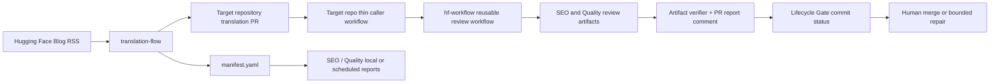
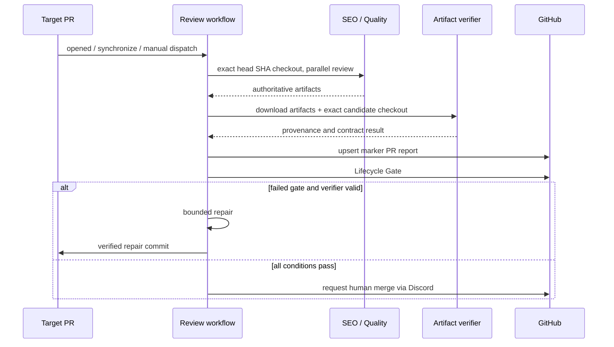

# HF Blog Workflow Spec

> 목적: 이 문서는 우리 로컬 세션에서 만든 구현, 결정, WIP를 놓치지 않고 다음
> 작업에서 이어 볼 수 있도록 한 곳에 정리한 Spec이다.
>
> 작성 기준: 2026-08-18 워크스페이스. Git 이력, `origin/main`, 현재 checkout,
> 그리고 현재 미커밋 변경을 함께 조사했다. 설계 제안과 실제 구현, WIP를
> 구분한다.

## 1. 범위와 현재 상태

이 Spec은 우리 세션에서 만든 PR/구현은 상세하게 기록한다. 다른 사람이 만든
변경은 현재 구현이 직접 의존할 때만 기준선 또는 contract로 짧게 언급한다. 이미
병합된 코드를 새 PR에 다시 복사하지 않고, 해당 기능의 현재 상태와 제약을
기록하는 방식을 사용한다.

저장소에는 다음 기준점이 동시에 보인다. 이 차이를 무시하면 새 작업이 이미
병합된 quality/metadata 기능을 되돌릴 수 있다.

| 구분 | 기준 | 의미 |
|---|---|---|
| GitHub `main` | `e0207f1` (PR #29, 2026-08-19) | 현재 원격의 병합 기준이다. PR #23, #24, #26–#29를 포함한다. |
| 로컬 `origin/main` | `e0207f1` (2026-08-19 fetch 기준) | 현재 GitHub `main`과 같다. 새 작업 전에는 다시 `git fetch origin`으로 최신 상태를 확인한다. |
| 현재 checkout | `codex/fix-daily-manifest-path`의 `f40126a` | PR agent 문서와 초창기 PR #19–#21 구현이 있는 별도 계통이다. 최신 병합 커밋을 포함하지 않는다. |
| 현재 미커밋 WIP | working tree 변경 | 기존 게시 번역문 revision mode와 review artifact provenance 강화 작업이다. 코드와 테스트가 있으나 아직 병합되지 않았다. |

따라서 작업을 이어갈 때의 기본 절차는 다음과 같다.

1. `git fetch origin` 후 GitHub `main`에서 새 작업 브랜치를 만든다.
2. 필요한 WIP만 선택적으로 rebase/cherry-pick 한다. 현재 WIP의 review runner는
   PR #23의 full quality harness를 다시 `simple_quality_report.py`로 바꿀 수
   있으므로 통째로 덮어쓰면 안 된다.
3. 아래의 “병합 전 정합성 결정”을 해소하고 테스트를 보강한다.

이 문서에서 **구현됨**은 GitHub `main`에 병합된 것, **WIP**는 현재 작업 트리에만
있는 것을 뜻한다.

## 2. 제품 목표와 저장소 경계

이 프로젝트는 Hugging Face Blog의 새 글을 한국어 Jekyll post로 번역하여
`Hugging-Face-KREW/hugging-face-krew.github.io`에 PR로 만들고, PR을 자동
검토·안전 수정·사람의 최종 merge 요청까지 연결한다.



| 영역 | 책임 | 주요 경로 |
|---|---|---|
| 번역 생성 | RSS 선택, 원문 수집, OpenAI/ECL 번역, branch/PR/manifest 생성 | `translation-flow/` |
| review skills | SEO/GEO와 번역 품질을 각각 평가하고 report/artifact 생성 | `skills/seo/`, `skills/quality/` |
| PR agent | lifecycle, 신뢰된 feedback, repair, thread, GitHub/Discord 통합 | `scripts/hf_agent/`, `scripts/` |
| 중앙 Actions | daily translation 및 재사용 review/mutation workflow | `.github/workflows/` |
| 운영 증거 | PR별 manifest와 SEO/quality report | `reports/pr-*/` |
| 실제 콘텐츠 PR | target repository의 post·caller workflow | `hugging-face-krew.github.io` (이 workspace에는 checkout되어 있지 않을 수 있음) |

`hf-workflow`는 중앙 로직만 갖는다. 대상 PR의 Checks 화면과 PR 이벤트를
정상적으로 받으려면 target repository에 thin caller workflow가 필요하다. 이
연동은 site PR #164에서 검증되었지만 target repository의 파일은 이 저장소의
source tree가 아니다.

## 3. 핵심 계약과 불변 조건

### 3.1 Translation manifest

`translation-flow`가 만드는 `manifest.yaml`은 콘텐츠 handoff 계약이다. 실행
상태, credential, retry 횟수는 넣지 않는다.

```yaml
version: 1
run:
  id: 2026-06-17-agentic-resource-discovery-launch
source:
  url: https://huggingface.co/blog/agentic-resource-discovery-launch
  slug: agentic-resource-discovery-launch
  title: "Agentic Resource Discovery: Let agents search"
translation:
  target_repo: Hugging-Face-KREW/hugging-face-krew.github.io
  branch: translate/agentic-resource-discovery-launch
  file_path: _posts/2026-06-17-agentic-resource-discovery-launch.md
  pr_url: https://github.com/Hugging-Face-KREW/hugging-face-krew.github.io/pull/144
  locale: ko
handoff:
  seo:
    enabled: true
    primary_keyword: ""
    secondary_keywords: []
  quality:
    enabled: true
    checks: [fidelity, fluency, terminology, formatting, links]
```

실제 예시는 [`reports/`](/Users/mjjwa/Documents/GitHub/mileage/hf/reports) 아래
`pr-131`, `132`, `137`, `138`, `141`–`144`에 남아 있다.

### 3.2 PR 자동화 안전 경계

자동 mutation은 아래 조건을 모두 만족할 때만 허용한다.

- PR이 open 상태이고 head repository가 target repository 자체다.
- `hf-agent:managed` label이 있고 `hf-agent:paused`가 없다.
- 변경된 post는 정확히 하나의 `_posts/*.md`다.
- comment/review 작성자는 `write`, `maintain`, `admin` 중 하나다.
- Bot 계정 및 `<!-- hf-agent-... -->` marker comment는 feedback으로 취급하지 않는다.
- mutation은 예상한 head SHA가 GitHub의 현재 head SHA와 같은지 다시 확인한다.
- 파일 수정은 translation post 한 파일로 제한하고, LLM feedback edit은 기본
  200 changed line을 넘을 수 없다.
- repair commit은 연속 3회까지만 허용한다. 안전하게 처리할 수 없거나 예산을
  다 쓰면 `hf-agent:needs-human` label과 실패 Lifecycle Gate로 멈춘다.

자연어 comment는 feedback이지 임의 shell/agent 명령이 아니다. PR lifecycle을
우회하는 자동 merge는 구현하지 않는다.

### 3.3 Lifecycle Gate

branch protection에서 요구해야 할 canonical status context는 하나다.

```text
HF Agent / Lifecycle Gate
```

`scripts/hf_agent/lifecycle.py`의 state 계산은 다음 조건을 강제한다.

| 결과 | 조건 |
|---|---|
| `pending` | review 시작 뒤 PR head SHA 또는 trusted feedback revision이 바뀜 |
| `failure` | `needs-human`, 미해결 review thread, 또는 blocking gate 실패 |
| `error` | report publish 실패 |
| `success` | 동일한 SHA와 feedback revision에서 gates, verifier, report, thread 조건을 모두 충족 |

`feedback_revision`은 trusted human issue comment, review, inline review comment의
`kind + id + updated_at + body`를 정렬해 SHA-256으로 계산한다. agent marker와
bot 입력은 제외한다. finalizer는 status를 publish하기 직전 GitHub API로 실제
PR head/feedback을 다시 읽으므로, 오래된 workflow 결과가 새 commit을 green으로
만드는 것을 막는다.

## 4. 구현된 전체 흐름

### 4.1 매일 새 번역 PR 생성

`.github/workflows/daily-translation.yml`이 매일 UTC 00:10에 실행되며,
`Asia/Seoul` 기준 전날을 기본 대상 날짜로 사용한다. 수동 실행은 `date`,
`post_url`, `dry_run`을 받는다.

`translation-flow/scripts/create_translation_pr.py`의 정상 모드는 다음을 수행한다.

1. RSS에서 대상 날짜의 HF Blog post를 선택한다.
2. community/enterprise 및 기존 번역 여부 정책을 적용한다.
3. 원문 HTML/Markdown과 메타데이터를 가져온다.
4. ECL block translation pipeline로 Markdown 구조를 보존해 한국어 draft를 만든다.
5. glossary 및 context-compression으로 글별 guide capsule을 넣는다.
6. `translate/<slug>` branch, post 파일, PR, manifest와 run summary를 생성한다.
7. target repo PR에 agent label을 보장하고, optional Discord 알림을 전송한다.
8. manifest를 기반으로 SEO/quality report를 `reports/pr-N/`에 보관한다.

OpenAI adapter, placeholder adapter, prompt와 guide 설정은 각각 다음을 참고한다.

- `translation-flow/scripts/translation_adapters.py`
- `translation-flow/scripts/ecl_translation_pipeline.py`
- `translation-flow/scripts/context_compression.py`
- `translation-flow/docs/translation_prompt.md`
- `translation-flow/docs/hf_translation_conventions.md`

필수 GitHub Actions secret은 `OPENAI_API_KEY`와 `KREW_BOT_TOKEN`이다.
`DISCORD_WEBHOOK_URL`은 선택 사항이며 통신 실패는 workflow를 실패시키지 않는다.

### 4.2 PR review와 artifact 흐름

target repo caller가 central `reusable-pr-review.yml`을 호출한다. review matrix는
`seo`, `quality` 두 skill을 병렬 실행한다.



다음 항목은 `origin/main`에 병합된 기준 구현이다.

#### SEO gate

- 엔트리포인트: `skills/seo/tools/seo_eval.py`.
- body-only deterministic required checks와 OpenAI rubric의 AND gate다.
- frontmatter는 gate에 넣지 않는다. metadata writer가 gate 통과 뒤 처리하므로,
  frontmatter를 SEO blocker로 만들면 deadlock이 된다.
- 대표 blocker는 primary keyword opening(D5, keyword가 있을 때), image alt
  coverage/descriptiveness(D6), local image file(D7)다. heading/structure,
  citation, link 등은 advisory다.
- reusable review는 `SEO_RUBRIC_OPENAI_REQUIRED=1`을 설정하여 green SEO에
  OpenAI rubric 결과를 요구한다.
- 출력: `seo.md`, wrapper `seo.json`, 구조화된 `seo-eval.json`, 그리고
  non-blocking `metadata-suggestion.json`.

#### Quality gate (PR #23)

- 엔트리포인트: `skills/quality/tools/translation_quality_harness.py`.
- 과거 `simple_quality_report.py`가 아니라 full harness가 PR runner에 연결되어
  있다. 새 구현에서 simple tool로 회귀시키지 않는다.
- source/target 구조, frontmatter, code block, link/image, number, glossary,
  style policy, translation-memory, segment alignment와 deterministic QE를
  검사한다.
- MQM LLM judge를 사용할 수 있으며 provider/model은 workflow 변수
  `QUALITY_LLM_JUDGE_PROVIDER`, `LLM_JUDGE_MODEL`,
  `QUALITY_LLM_JUDGE_MAX_SEGMENTS`로 정한다. 병합 기준 기본 모델은
  `gpt-5.6-luna`다.
- 출력: `quality.md`, `quality.json`, `quality-eval.json`, PR comment, source/
  target segments, MQM JSONL, metric cache.
- quality structured status `auto_pass`와 `review_required`는 wrapper상 pass로
  매핑된다. 단 `auto_pass`에는 semantic evaluation complete와 전체 MQM segment
  coverage가 필요하다. PR #26은 `review_required`를 incomplete semantic
  evaluation 때문에 verifier가 잘못 reject하지 않도록 수정했다.
- PR #27은 MQM judge가 실제 segment를 하나도 처리하지 않아 skip된
  `review_required` 결과를 허용한다. 단 judge segment가 하나라도 있으면
  `prompt_hash`는 계속 필수다.

#### Authoritative artifact verifier와 MQM cache (PR #23, #26, #27, #29)

`scripts/hf_agent/verify_review_artifacts.py`는 judge를 재실행하지 않는다.
review job이 만든 artifact bundle만 신뢰 가능한지 검증한다.

- `quality.json`, `quality.md`, `quality-eval.json`, `seo.json`, `seo.md`,
  `seo-eval.json`의 존재를 요구한다.
- wrapper conclusion이 SEO/quality의 구조화 상태와 일치하는지 확인한다.
- quality `target_hash`, target path, MQM provider/model/prompt hash와
  successful quality의 segment coverage를 확인한다.
- exact candidate checkout의 Git HEAD가 workflow input `head_sha`와 동일한지
  확인한다.
- MQM segment가 있는 `review_required` artifact는 `prompt_hash`를 반드시
  포함해야 한다. segment가 없는 skipped judge만 이 필드를 비워 둘 수 있다.
- downstream report와 repair는 review를 다시 실행하지 않고 이 artifact를
  다운로드해 사용한다.

PR #29는 quality MQM judge artifact cache를 추가했다. cache key는 target
repository, post path, candidate content SHA-256, MQM provider/model/max-segments,
그리고 MQM prompt·style guide·schema의 digest를 묶는다. 따라서 같은 콘텐츠와
동일한 judge contract만 결과를 재사용하며, source policy나 prompt가 바뀌면 cache
key도 바뀐다.

artifact는 runner temporary directory에서 upload되고, 이름에는 skill과 head SHA가
포함된다. retention은 1일이다. report job은 verifier success일 때만 PR marker
comment를 upsert한다.

### 4.3 SEO metadata는 별도 write-back 경로다 (PR #24)

SEO body gate의 결과와 metadata 후보는 반드시 분리한다.

| 파일 | 의미 | lifecycle을 fail 시키는가 |
|---|---|---:|
| `seo.json` | SEO gate wrapper (`skill`, `conclusion`, `report_path`) | 예 |
| `seo-eval.json` | SEO 평가의 구조화된 입력/결과 | 예, `seo.json`을 통해 |
| `metadata-suggestion.json` | frontmatter 후보와 apply contract | 아니오 |

`metadata-suggestion.json`은 `kind: seo_metadata_suggestion`을 가져야 하며
`skill`이나 `conclusion`을 넣어서는 안 된다. 상태는 `SKIPPED`, `PARTIAL`,
`READY`, `ERROR`이고 metadata 실패는 SEO gate failure로 승격되지 않는다.

SEO와 verifier가 green인 경우 별도 `metadata_apply` job이 deterministic하고
idempotent하게 제안을 적용할 수 있다. PARTIAL에서는 `title`, `description`,
`categories`, `image`만 safe field로 적용할 수 있고, `canonical`, `hreflang`,
`json_ld`는 metadata policy가 명확하여 `READY + allowed + !requires_human`을
만족할 때만 적용한다. 수정은 frontmatter 한 파일에 한정하고 별도 commit으로
push한 뒤 SEO와 quality를 재검증한다.

trusted reviewer는 PR comment에 `metadata apply` 또는 `메타데이터 적용`을 남겨
metadata apply flow를 요청할 수 있다. `scripts/hf_agent/apply_metadata_suggestion.py`
가 policy와 target path를 검증해 처리한다. 전체 I/O contract는
`specs/seo-metadata-module-io.md`에 있다.

### 4.4 Trusted feedback과 repair

feedback event는 issue comment, submitted/edited review, inline review comment다.
`route_pr_feedback.py`와 `handle_pr_feedback.py`는 권한·managed label·bot marker를
검사하고, 현재 PR head SHA에 즉시 Lifecycle Gate `pending`을 게시한다.

가능한 disposition은 `actionable`, `addressed`, `no-change`, `needs-human`이다.

- deterministic repair: `<!-- TODO ... -->` marker는 자동 gate repair일 때
  LLM 호출 전에 제거할 수 있다.
- LLM repair: complete Markdown JSON만 받고, code/link/product name/Markdown을
  보존하도록 prompt를 준다. excessive diff와 sentence-final punctuation 대량
  손실은 reject한다.
- PR #28부터 repair model 호출은 strict JSON Schema를 사용한다. 응답은
  `disposition`, `reason`, `content` 세 필드를 모두 포함해야 하며,
  non-actionable disposition의 `content`는 빈 문자열이다. 최대 output은
  65,536 tokens다.
- 실패 gate repair: report를 feedback으로 변환하고 trailing repair commit 수가
  3 미만일 때만 수정한다.
- changed content는 SEO와 quality가 다시 통과해야 push한다.
- inline review comment는 처리 근거로 reply를 남긴 뒤, `needs-human`이 아닌
  경우에만 GraphQL로 thread를 resolve한다.
- unresolved review thread가 하나라도 있으면 Lifecycle Gate는 failure다.

mutation workflow에는 `hf-agent-mutate-<target_repo>-<pr_number>` concurrency
group이 있다. 같은 PR의 branch write는 직렬화한다.

## 5. WIP: 이미 게시된 번역문 revision mode

현재 working tree에는 아직 병합되지 않은 revision mode가 있다. 목적은 RSS에서
새 번역을 만드는 것과 별도로, source post 하나를 지정해 이미 발행된 한국어
번역을 제한적으로 다시 검토하고 correction PR만 여는 것이다.

사용 의도는 다음과 같다.

```bash
cd translation-flow
uv run python scripts/create_translation_pr.py \
  --post-url https://huggingface.co/blog/example \
  --target-worktree /path/to/hugging-face-krew.github.io \
  --target-repo Hugging-Face-KREW/hugging-face-krew.github.io \
  --translator openai \
  --revise-existing \
  --revision-id manual-2026-08-03
```

구현된 WIP 규칙은 아래와 같다.

1. 기존 post는 `source_url` frontmatter의 normalized URL로 먼저 찾고, 없을 때만
   filename slug로 fallback한다. 여러 개가 매치되면 중단한다.
2. OpenAI revision adapter는 `revised | no_change`, reason, complete content를
   담은 JSON만 허용한다.
3. meaningful change가 없으면 branch, commit, PR을 만들지 않고 run summary에
   `no_changes`를 기록한다.
4. change가 있으면 `revise/<slug>-<revision-id>` branch와 revision manifest를
   만든다.
5. 기존 frontmatter와 fenced code block은 보호한다. line-change budget을 넘거나
   code block이 제거/변경되면 reject한다.

daily workflow WIP도 `workflow_dispatch.revise_existing`을 추가하여
`--post-url`과 함께 이 경로를 실행한다. 이 작업은 새 RSS item용
`--skip-existing` 경로와 상호 배타적으로 유지해야 한다.

### 현재 확인된 baseline test 불일치

2026-08-18에 `translation-flow` test suite를 실행했을 때 37개는 통과했고,
`test_build_translation_markdown_includes_source_passthrough_frontmatter` 한 개가
실패했다. test는 source `thumbnail`이 output에도 `thumbnail:`으로 남는다고
기대하지만, 현재 renderer는 target Jekyll post의 `image:` field만 emit한다.
이 불일치는 revision WIP 변경과 무관하게 HEAD의 source/test 조합에도 존재한다.
다음 작업에서는 target site의 실제 frontmatter contract를 확인해 `thumbnail`을
보존할지, `image`로 normalize할지 결정한 뒤 implementation과 test를 함께
정렬해야 한다.

## 6. Artifact provenance와 WIP 정합성

PR #29는 wrapper artifact에 다음 identity를 넣고 verifier가 검증하도록 병합했다.

- `head_sha`
- repo-relative `file_path`
- candidate `target_hash` (SHA-256)

현재 working tree에는 위 identity를 `schema_version`, `content_sha256`,
`report_sha256`까지 확장하려는 WIP가 있다. 방향은 맞지만 WIP version은 초창기
simple quality runner를 기반으로 하므로, PR #23/#26/#29의 full quality harness와
artifact contract를 덮어쓰면 안 된다.

다음 작업에서 반드시 유지·결정해야 할 통합 기준은 아래다.

1. **`origin/main`의 full quality harness를 보존한다.** WIP에서
   `simple_quality_report.py`로 바꾼 runner를 그대로 가져오지 않는다.
2. 이미 병합된 wrapper binding (`head_sha`, `file_path`, `target_hash`)을
   보존하고, 필요할 때 WIP의 `content_sha256`, `report_sha256`을 추가한다.
3. verifier는 두 층을 모두 검증한다.
   - provenance: exact checkout HEAD, path, content/report digest, skill별
     artifact uniqueness
   - semantic contract: existing quality hash/status/MQM provider/model/prompt
     hash/coverage 및 SEO structured gate
4. report와 repair는 다시 judge를 돌리지 않고 **동일한 검증 완료 artifact**를
   읽는다.
5. artifact upload 경로·filename·retention을 한 contract로 맞추고, JSON을
   partially written 상태로 upload하지 않게 한다.
6. merge한 뒤 workflow E2E에서 pass, one-gate fail, artifact tamper, stale SHA,
   `review_required` quality status를 모두 확인한다.

이 항목이 해소되기 전에는 current checkout WIP를 `origin/main` 위로 rebase한
뒤 conflict를 수동으로 해결해야 한다. 단순 merge 또는 checkout overwrite는
품질 하니스·metadata apply 기능을 잃을 위험이 있다.

## 7. 주요 변경 이력

아래는 기능 맥락을 복구하는 데 의미 있는 PR/커밋만 압축한 표다. 숫자가 없는
행은 해당 계통의 직접 커밋 또는 merge commit이다.

| 시기 | PR/커밋 | 도입한 기능 |
|---|---|---|
| 2026-05 | #1, #2 | translation PR Discord 알림과 ECL translation pipeline의 기반 |
| 2026-06 | #7, #8 | KST 기준 daily date 및 conservative body-only SEO gate/offline eval harness |
| 2026-06 | #11–#15 | Discord non-blocking, manifest recovery/report 저장, ECL guide compression, Discord user agent, thumbnail asset download |
| 2026-06–07 | #16, #17 | SEO evaluation fixtures와 semantic/metadata policy seam |
| 2026-07 | #19 | `Lifecycle Gate`, trusted feedback revision, GitHub snapshot/finalizer core |
| 2026-07 | #20 | reusable review matrix, PR marker report, bounded gate repair 기반 |
| 2026-07 | #21 | trusted feedback mutation, review thread reply/resolve, deterministic TODO repair |
| 2026-07 | #22 | daily translation review wiring 보정 |
| 2026-07 | #23 (`310c969`) | full translation quality harness를 PR runner에 연결, authoritative artifact 재사용 |
| 2026-07 | #24 (`e9dbf27`) | SEO metadata suggestion을 gate에서 분리하고 safe frontmatter apply 추가 |
| 2026-07 | #26 (`d0aaac9`) | `review_required` quality 상태의 verifier blocker 판정 보정 |
| 2026-07 | #27 (`7106b017`) | MQM judge가 실제로 skip된 `review_required` artifact를 허용하되, segment가 있으면 prompt hash를 계속 요구 |
| 2026-07 | #28 (`5305213`) | repair model의 strict structured JSON Schema와 65,536-token output limit 적용 |
| 2026-08 | #29 (`e0207f1`) | candidate SHA와 judge contract digest로 MQM artifact cache를 복원·저장하고 wrapper/verification identity를 강화 |
| 현재 WIP | 미커밋 | published-post revision mode와 content/report digest 기반 artifact provenance |

## 8. 코드 변경 시 지켜야 할 운영 규칙

- `manifest.yaml`은 콘텐츠 계약이다. API token, run attempt, GitHub delivery
  state를 넣지 않는다.
- target repo의 caller와 central reusable workflow의 input names, SHA, secrets를
  함께 바꾸지 않으면 production trigger가 깨진다.
- mutation 전 stale SHA 검사를 제거하지 않는다.
- `KREW_BOT_TOKEN`은 target repo read/write PR 권한, `OPENAI_API_KEY`는 review
  또는 mutation에 필요한 경우에만 주입한다. token/key를 log, manifest, report에
  쓰지 않는다.
- gate result와 metadata suggestion을 한 `conclusion`으로 섞지 않는다.
- re-run 할 수 있는 job은 결과가 중복 comment/commit을 만들지 않아야 한다.
  marker comment upsert와 metadata apply idempotency를 유지한다.
- `hf-agent:paused`가 붙으면 read-only 진단조차 실제 workflow 조건과 일치하는지
  확인하고 mutation은 절대 수행하지 않는다.
- generated PPTX, PDF, PNG, `output/`, `outputs/`, `tmp/`는 implementation
  source가 아니다. 이 문서, `scripts/`, `skills/`, `translation-flow/`,
  `.github/workflows/`, tests를 우선한다.

## 9. 검증 방법

작업 범위에 맞는 최소 검증을 실행한다. 최신 병합 기준선에서 WIP를 통합하는
경우에는 아래 네 그룹을 모두 실행하는 것이 권장된다.

```bash
# PR agent/lifecycle, review workflow, artifact verifier
python -m pytest tests -q

# Translation and revision mode
(cd translation-flow && uv run pytest -q)

# SEO deterministic/rubric/metadata contracts
(cd skills/seo && python -m pytest tests -q)

# Quality harness, policy, MQM contract
(cd skills/quality && python -m pytest tests -q)

# whitespace / patch sanity
git diff --check
```

WIP artifact integration 뒤에는 unit test만으로 충분하지 않다. 최소로 다음
workflow-level cases를 검증한다.

- exact head SHA의 clean SEO + quality artifact → Lifecycle Gate success
- SEO 또는 quality failure → report upsert와 1회 repair 시도
- artifact JSON/report/candidate bytes 중 하나를 바꿈 → verifier failure
- repair 동안 새 commit 또는 trusted feedback 생성 → 이전 run은 pending/failure,
  새 head에 재실행
- `review_required` quality status → PR #26–#27의 의도대로 verifier가 false
  blocker를 만들지 않되, 처리된 MQM segment의 prompt hash는 계속 검증
- metadata `PARTIAL`, `READY`, `ERROR` → 각각 safe-only apply, policy apply,
  lifecycle non-blocking
- revision `no_change`, frontmatter change, code-block change, line budget 초과

## 10. 다음 작업을 위한 시작 지시문

아래 문장을 새 작업의 첫 context로 그대로 사용해도 된다.

> 이 Spec을 먼저 읽고 `git fetch origin`으로 GitHub `main`을 최신화하라. 현재
> checkout의 미커밋 revision/artifact 작업은 별도 WIP다. full quality harness
> (PR #23), SEO metadata separation(PR #24), verifier behavior(PR #26–#27),
> structured repair response(PR #28), MQM cache와 wrapper identity(PR #29)를
> 보존하라. 특히 WIP review runner를 통째로 가져와
> `simple_quality_report.py`로 회귀시키지 말고, SHA/digest provenance만 최신
> artifact contract에 통합하라. target PR의 현재 head SHA,
> trusted feedback, one-post mutation, bounded repair, Lifecycle Gate 불변 조건을
> 깨지 말고 변경 범위에 맞는 pytest와 workflow artifact tests를 실행하라.

## 11. 관련 문서

- [HF Blog Workflow Spec](hf-blog-workflow-spec.md) — 이 문서
- [초기 PR agent 구현 제안](pr-agent-implementation-spec.md) — 일부 구현 전
  가정이 남아 있으므로 현재 상태의 source of truth로 쓰지 않는다.
- [장기 아키텍처 설계](agent-workflow-design.md) — 의도와 future direction 참고용
- [Skill 연동 가이드](pr-agent-skill-integration-guide.md) — skill result contract의
  초기 버전 참고용
- [SEO metadata I/O](seo-metadata-module-io.md) — metadata JSON/apply의 최신
  contract
