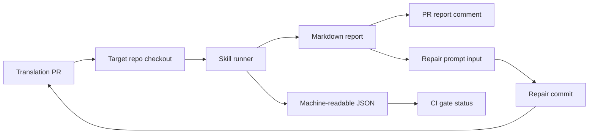
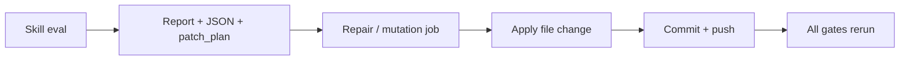

# HF Agent Skill 연동 가이드

작성일: 2026-07-05  
대상 저장소: `Hugging-Face-KREW/hf-workflow`  
대상 독자: SEO / Quality / 기타 review skill 개발자와 리뷰어

## 0. 바로 해야 할 일

스킬 개발자가 지금 맞춰야 하는 작업은 아래 5가지입니다.

1. 각 skill CLI가 같은 입출력 형태를 지원하게 만듭니다.

   ```bash
   python3 skills/<skill>/tools/<entrypoint>.py \
     --manifest manifest.yaml \
     --target-root ../target \
     --output-md report.md \
     --output-json result.json
   ```

2. JSON result에 `status`, `blocking`, `repairable`, `findings`를 넣습니다.

3. Markdown report는 사람이 읽는 설명이면서 동시에 repair prompt로 쓸 수 있게
   작성합니다.

4. 자동 수정 가능한 실패와 사람이 봐야 하는 blocked 상태를 구분합니다.

5. skill은 GitHub comment, commit, branch push, review thread resolve를 직접 하지
   않습니다. 파일 수정과 commit은 agent workflow의 mutation/repair job이 담당합니다.

PR별로는 아래 작업을 요청합니다.

| PR | 작성자가 해야 할 핵심 작업 |
|---|---|
| [hf-workflow #16](https://github.com/Hugging-Face-KREW/hf-workflow/pull/16) | fixture마다 `status`, `blocking`, `repairable` 기대값을 명시합니다. |
| [hf-workflow #17](https://github.com/Hugging-Face-KREW/hf-workflow/pull/17) | SEO semantic/metadata 결과를 직접 commit하지 말고 `patch_plan` 또는 `findings[].suggested_fix`로 출력합니다. |
| [hf-workflow #3](https://github.com/Hugging-Face-KREW/hf-workflow/pull/3) | full quality harness에 PR runner mode를 추가하고 source/reference가 없어도 degrade되게 만듭니다. |

## 1. 목적

이 문서는 PR comment agent loop에 review skill을 연결하기 위해 각 skill이 어떤
입력을 받고 어떤 출력을 만들어야 하는지 정리합니다.

스킬 개발자는 GitHub PR, comment, commit, review thread를 직접 조작하지 않고,
다음 두 가지 책임만 갖습니다.

- 번역 PR의 현재 파일을 검사합니다.
- CI와 repair loop가 읽을 수 있는 Markdown report와 JSON result를 생성합니다.

GitHub comment 게시, failed gate repair, commit push, review thread resolve,
Lifecycle Gate 업데이트는 agent workflow가 담당합니다.

## 2. 전체 데이터 흐름



핵심은 간단합니다. 스킬은 report를 쓰고 exit code를 반환합니다. agent loop는 그
결과를 PR comment, CI check, repair loop에 재사용합니다.

## 3. Skill runner가 제공하는 input

권장 CLI 형태는 아래와 같습니다.

```bash
python3 skills/<skill>/tools/<entrypoint>.py \
  --manifest manifest.yaml \
  --target-root ../target \
  --output-md report.md \
  --output-json result.json
```

현재 구현 일부는 아직 과도기 상태입니다.

- SEO는 `seo_eval.py --file <path> --target-root <target-root> --output <report.md>`도 지원합니다.
- Quality는 현재 `simple_quality_report.py`를 사용하며, [hf-workflow #3](https://github.com/Hugging-Face-KREW/hf-workflow/pull/3)의 full harness는 아직 연결하지 않았습니다.

장기적으로는 모든 skill이 `manifest + target-root + output-md + output-json` 형태를
지원하는 것이 좋습니다.

## 4. Manifest 구성

최소 manifest는 아래 필드를 포함해야 합니다.

```yaml
source:
  url: https://huggingface.co/blog/example
  title: Optional source title

translation:
  file_path: _posts/2026-07-05-example.md
  locale: ko

handoff:
  seo:
    primary_keyword: Optional keyword
    secondary_keywords:
      - Optional keyword
  quality:
    glossary: Optional glossary reference
```

필드 의미:

| Field | Required | 의미 |
|---|---:|---|
| `source.url` | 권장 | 원문 출처 URL입니다. source comparison이나 attribution check에 사용합니다. |
| `translation.file_path` | 필수 | target repo 기준 번역 파일 경로입니다. |
| `translation.locale` | 권장 | 번역 언어입니다. |
| `handoff.seo` | 선택 | SEO skill에 전달할 keyword/policy 정보입니다. |
| `handoff.quality` | 선택 | Quality skill에 전달할 glossary/policy 정보입니다. |

주의: manifest에는 retry count, GitHub delivery state, workflow run id, credential 같은
실행 상태를 넣지 않습니다. manifest는 콘텐츠 정보를 전달하는 입력 파일로 유지합니다.

## 5. Markdown report 구성

Markdown report는 사람이 PR comment에서 읽고, agent repair prompt도 그대로
사용합니다. 따라서 report는 설명문이 아니라 actionable evidence여야 합니다.

좋은 report 예시:

```md
# SEO Report

Gate: FAIL

## Blocking findings

- ID: missing-alt
  - File: `_posts/2026-07-05-example.md`
  - Line: 42
  - Problem: image alt text is missing
  - Suggested fix: add concise Korean alt text describing the image
  - Repairable: true

## Advisory findings

- Frontmatter description is short, but this does not block merge.
```

피해야 할 report:

```md
SEO score is low. Please improve the post.
```

이런 report는 repair loop가 무엇을 고쳐야 하는지 알 수 없습니다.

## 6. JSON result 구성

권장 JSON schema는 아래 형태입니다.

```json
{
  "skill": "seo",
  "status": "needs_changes",
  "blocking": true,
  "repairable": true,
  "summary": "One blocking SEO finding requires changes.",
  "findings": [
    {
      "id": "missing-alt",
      "severity": "error",
      "blocking": true,
      "repairable": true,
      "path": "_posts/2026-07-05-example.md",
      "line": 42,
      "message": "Image alt text is missing.",
      "suggested_fix": "Add concise Korean alt text describing the image."
    }
  ]
}
```

필드 의미:

| Field | Required | 의미 |
|---|---:|---|
| `skill` | 필수 | `seo`, `quality` 등 skill id입니다. |
| `status` | 필수 | `pass`, `needs_changes`, `fail`, `blocked` 중 하나입니다. |
| `blocking` | 필수 | true면 Lifecycle Gate를 실패시킵니다. |
| `repairable` | 필수 | true면 repair loop가 자동 수정을 시도할 수 있습니다. |
| `summary` | 권장 | PR comment 상단 요약에 사용할 수 있습니다. |
| `findings[]` | 권장 | 개별 문제 목록입니다. |
| `findings[].path` | 권장 | target repo 기준 파일 경로입니다. |
| `findings[].line` | 선택 | 가능하면 line number를 제공합니다. |
| `findings[].suggested_fix` | 권장 | repair prompt에 들어갈 수정 지시입니다. |

현재 wrapper는 과도기적으로 아래 최소 JSON도 읽습니다.

```json
{
  "skill": "seo",
  "conclusion": "pass",
  "report_path": "/tmp/seo.md"
}
```

다만 앞으로는 `status/blocking/repairable/findings` 형태로 확장하는 것이 좋습니다.

## 7. Status와 exit code

권장 status 의미는 아래와 같습니다.

| Status | Exit code | Blocking | Repairable | 의미 |
|---|---:|---:|---:|---|
| `pass` | `0` | false | false | merge gate 통과 |
| `needs_changes` | `1` | true | true | 자동 수정 가능한 변경 필요 |
| `fail` | `1` | true | true 또는 false | gate 실패. 자동 수정 가능 여부는 finding에 따름 |
| `blocked` | `1` 또는 추후 `2` | true | false | 정책/입력/API/사람 판단이 필요 |

현재 GitHub Actions는 exit code `0`이면 pass, non-zero면 fail로 봅니다. 따라서
`blocked`도 현재는 non-zero로 반환해야 합니다.

## 8. Repair loop 친화적인 finding 작성법

자동 수정 가능한 finding은 아래 정보를 포함해야 합니다.

- 어떤 파일을 고칠지
- 어떤 줄 또는 어떤 패턴을 고칠지
- 왜 실패인지
- 어떤 형태로 고치면 되는지
- 자동 수정해도 안전한지

예시:

```json
{
  "id": "todo-marker",
  "severity": "error",
  "blocking": true,
  "repairable": true,
  "path": "_posts/2026-07-05-example.md",
  "message": "TODO marker remains in the translated post.",
  "suggested_fix": "Remove placeholder TODO comments from the translated post."
}
```

자동 수정하면 안 되는 finding은 `repairable: false`로 표시합니다.

```json
{
  "id": "source-changed",
  "severity": "error",
  "blocking": true,
  "repairable": false,
  "message": "The source document changed after translation started.",
  "suggested_fix": "Ask a human to refresh the translation source."
}
```

## 9. Skill이 하지 말아야 할 일

스킬은 아래 작업을 직접 하지 않습니다.

- PR comment 작성
- GitHub review thread resolve
- commit push
- branch 변경
- label 변경
- Discord notification 발송
- merge 가능 여부 최종 판단

이 작업들은 agent workflow가 중앙에서 처리해야 loop safety와 audit trail을 유지할 수
있습니다.

예외적으로 skill이 deterministic patch plan을 계산하는 것은 괜찮습니다. 다만 그
patch를 파일에 적용하고 commit하는 작업은 skill이 아니라 workflow의 repair/mutation
job에서 수행해야 합니다.

권장 분리:



## 10. Provider/API 의존성 처리

LLM judge, semantic judge, COMETKiwi, Lighthouse 등 외부 의존성이 있는 검사는
기본 deterministic gate를 깨뜨리면 안 됩니다.

권장 정책:

- deterministic check는 항상 provider 없이 동작합니다.
- provider가 없으면 semantic check는 `skipped`, `unavailable`, 또는 정책상 `blocked`로 보고합니다.
- provider 실패로 Python exception이 그대로 CI failure가 되면 안 됩니다.
- 외부 모델 기반 검사는 기본 gate와 optional verifier를 분리합니다.

예시:

```json
{
  "id": "semantic-metadata-judge",
  "severity": "info",
  "blocking": false,
  "repairable": false,
  "message": "Semantic judge skipped because OPENAI_API_KEY is not configured."
}
```

## 11. PR별 action items

### 11.1 [hf-workflow #16 — test: add SEO evaluation fixture corpus](https://github.com/Hugging-Face-KREW/hf-workflow/pull/16)

이 PR은 loop에 직접 연결되는 runtime code가 아니라 SEO fixture corpus입니다.

Must:

- `evaluation_manifest.yml`의 expected label을 loop status와 맞춥니다.
  - `pass`
  - `needs_changes`
  - `fail`
  - `blocked`
- fixture마다 `blocking`과 `repairable`을 명시합니다.
- 최소 1개 이상의 자동 수정 가능한 negative fixture를 표시합니다.
- 최소 1개 이상의 자동 수정 불가능한 blocked fixture를 표시합니다.

Should:

- report output golden을 일부 추가합니다.
  - agent loop에서는 JSON뿐 아니라 Markdown report도 repair prompt로 사용합니다.
- negative fixture를 자동 수정 가능/불가능으로 나눕니다.
  - 자동 수정 가능: missing alt, TODO marker, broken image path
  - 자동 수정 불가: source policy 없음, semantic ambiguity, canonical/hreflang 정책 미정

Do not:

- fixture label을 SEO 내부 용어로만 유지하지 않습니다.
  - 예: `semantic-negative`만 쓰면 agent loop가 blocking/repairable 여부를 알 수 없습니다.
- runtime gate 동작을 이 PR에 섞지 않습니다.
  - 이 PR은 fixture corpus PR로 유지하고, runtime 변경은 [hf-workflow #17](https://github.com/Hugging-Face-KREW/hf-workflow/pull/17)에서 다룹니다.

권장 fixture metadata 예시:

```yaml
fixtures:
  - path: mutated/meaningless-alt.md
    expected:
      status: needs_changes
      blocking: true
      repairable: true
      skill: seo
```

Done 기준:

- fixture manifest만 보고도 해당 케이스가 PR에서 green/pass인지, red/repair인지,
  red/human-needed인지 판단할 수 있습니다.
- [hf-workflow #17](https://github.com/Hugging-Face-KREW/hf-workflow/pull/17)의 SEO gate가 이 fixture metadata를 regression test로 사용할 수 있습니다.

### 11.2 [hf-workflow #17 — feat: add SEO semantic and metadata policy seams](https://github.com/Hugging-Face-KREW/hf-workflow/pull/17)

이 PR은 agent loop와 직접 연결될 가능성이 큽니다. 특히
`PASS / NEEDS_CHANGES / FAIL / BLOCKED` 분리는 loop status 모델로 쓰기 좋습니다.

Must:

- `seo_eval.py`가 `--manifest`, `--target-root`, `--output-md`, `--output-json` 형태를 안정적으로 지원해야 합니다.
- 기존 `--file` mode도 깨지지 않아야 합니다.
- provider 없는 환경에서 semantic judge가 crash하지 않아야 합니다.
- `NEEDS_CHANGES`와 `BLOCKED`의 exit code / JSON mapping을 명확히 해야 합니다.
- report가 repair prompt로 사용할 수 있을 만큼 구체적이어야 합니다.
- metadata generation은 review gate에서 직접 commit하지 않아야 합니다.
  - review gate는 plan/report만 생성합니다.
  - 실제 mutation은 repair job이 수행합니다.

Should:

- metadata 변경이 필요한 경우 `patch_plan`을 JSON에 넣습니다.
- `patch_plan`이 없더라도 `findings[].suggested_fix`만으로 repair job이 수정할 수 있게 작성합니다.
- semantic judge가 unavailable이면 명시적으로 report에 남깁니다.
- `BLOCKED`는 사람이 정책 결정을 해야 하는 경우에만 사용합니다.

Do not:

- `seo_eval.py` 실행 중 target file을 수정하지 않습니다.
- `seo_eval.py` 실행 중 commit/push하지 않습니다.
- metadata policy가 없다는 이유만으로 Python exception을 발생시키지 않습니다.
- provider key가 없다는 이유만으로 deterministic SEO gate 전체를 실패시키지 않습니다.

권장 방향:

```text
SEO gate = deterministic required checks + optional semantic seams
Metadata writer = gate 통과 후 별도 mutation task 또는 suggested patch
```

권장 JSON 예시:

```json
{
  "skill": "seo",
  "status": "needs_changes",
  "blocking": true,
  "repairable": true,
  "summary": "SEO metadata needs a deterministic frontmatter update.",
  "findings": [
    {
      "id": "metadata-description-missing",
      "severity": "error",
      "blocking": true,
      "repairable": true,
      "path": "_posts/2026-07-05-example.md",
      "message": "Frontmatter description is missing.",
      "suggested_fix": "Add a concise Korean SEO description to frontmatter.description."
    }
  ],
  "patch_plan": {
    "path": "_posts/2026-07-05-example.md",
    "frontmatter": {
      "description": "Suggested Korean SEO description."
    }
  }
}
```

Done 기준:

- `seo_eval.py`가 read-only로 실행됩니다.
- output JSON만 보고 agent workflow가 pass/fail/blocked/repair 가능 여부를 판단할 수 있습니다.
- metadata 수정이 필요한 경우에도 skill은 commit하지 않고 repair job이 적용할 수 있는 plan을 남깁니다.

### 11.3 [hf-workflow #3 — Add translation quality evaluation harness](https://github.com/Hugging-Face-KREW/hf-workflow/pull/3)

이 PR은 full quality harness 후보입니다. 현재 loop는 아직 이 harness를 사용하지 않고
`simple_quality_report.py`를 사용합니다.

Must:

- PR runner용 CLI mode를 추가합니다.

```bash
python3 skills/quality/tools/translation_quality_harness.py \
  --manifest manifest.yaml \
  --target-root ../target \
  --output-md quality.md \
  --output-json quality.json
```

- source markdown, reference translation, translation memory가 없어도 동작해야 합니다.
- source comparison이 불가능한 check는 `skipped` 또는 `blocked`로 degrade해야 합니다.
- target-only check는 계속 실행해야 합니다.
  - TODO marker
  - code fence balance
  - frontmatter
  - link/image syntax
  - glossary
  - protected patterns
- 기존 harness 상태를 loop status로 매핑합니다.

| Quality harness 상태 | Loop status |
|---|---|
| clean | `pass` |
| review_required | `needs_changes` |
| reject | `fail` |
| source_changed | `blocked` |

Should:

- COMETKiwi, LLM MQM judge 등 heavy dependency는 기본 gate에서 분리합니다.
- Markdown report에 actionable finding을 포함합니다.
- source/reference가 없어서 skip한 check를 report에 명확히 표시합니다.
- deterministic target-only checks는 fixture 없이도 실제 PR file에서 실행 가능해야 합니다.

Do not:

- source/reference/translation memory가 없다는 이유로 전체 CLI를 crash시키지 않습니다.
- heavy model dependency를 default CI gate의 필수 dependency로 만들지 않습니다.
- quality harness가 직접 commit/push하지 않습니다.

권장 연결 순서:

1. 현재 `simple_quality_report.py` 유지
2. [hf-workflow #3](https://github.com/Hugging-Face-KREW/hf-workflow/pull/3)에 PR runner adapter 추가
3. fixture 기반으로 `pass / needs_changes / fail / blocked` mapping 테스트 추가
4. agent loop에서 quality entrypoint를 full harness로 교체

Done 기준:

- 아래 명령이 source/reference 없이도 Markdown report와 JSON result를 생성합니다.

  ```bash
  python3 skills/quality/tools/translation_quality_harness.py \
    --manifest manifest.yaml \
    --target-root ../target \
    --output-md quality.md \
    --output-json quality.json
  ```

- output JSON의 status가 `pass`, `needs_changes`, `fail`, `blocked` 중 하나입니다.
- repair 가능한 quality failure는 `repairable: true` finding을 포함합니다.

## 12. 팀원에게 요청할 체크리스트

스킬 PR 리뷰 시 아래 항목을 확인하면 됩니다.

- [ ] `manifest + target-root + output-md + output-json` 실행 형태를 지원하는가?
- [ ] provider/API 없이 deterministic path가 동작하는가?
- [ ] Markdown report가 PR comment에서 사람이 읽기 쉬운가?
- [ ] Markdown report가 repair prompt로도 충분히 구체적인가?
- [ ] JSON result에 `status`, `blocking`, `repairable`, `findings`가 있는가?
- [ ] 자동 수정 가능한 실패와 human이 필요한 blocked를 구분하는가?
- [ ] skill이 GitHub comment/commit/resolve를 직접 하지 않는가?
- [ ] fixture가 status와 repairability를 검증하는가?
- [ ] 기존 CLI나 테스트를 깨지 않는가?

## 13. 현재 판단

- [hf-workflow #16](https://github.com/Hugging-Face-KREW/hf-workflow/pull/16)은 fixture corpus로 유용합니다. 다만 loop 연동 검증용 metadata를 추가하면 더 좋습니다.
- [hf-workflow #17](https://github.com/Hugging-Face-KREW/hf-workflow/pull/17)은 SEO gate의 장기 방향과 잘 맞습니다. status/manifest/provider-missing 동작을 명확히 해야 합니다.
- [hf-workflow #3](https://github.com/Hugging-Face-KREW/hf-workflow/pull/3)은 quality gate 본체 후보입니다. 현재 loop에 바로 교체하기 전 adapter와 degrade behavior가 필요합니다.

## 14. PR별 담당자 확인 항목

이 섹션은 각 PR 담당자가 자기 PR에서 확인해야 할 내용을 요약합니다. 리뷰어는
아래 항목을 기준으로 PR이 agent loop에 연결될 준비가 되었는지 판단하면 됩니다.

### 14.1 [hf-workflow #16](https://github.com/Hugging-Face-KREW/hf-workflow/pull/16) 담당자 확인 항목

확인할 내용:

- expected.status: pass / needs_changes / fail / blocked
- expected.blocking: true / false
- expected.repairable: true / false
- 자동 수정 가능한 negative fixture와 human-needed blocked fixture를 구분
- 일부 fixture에 대해 report output golden 추가

완료 기준:

- fixture manifest만 보고도 각 case가 green/pass인지, red/repair인지,
  red/human-needed인지 판단할 수 있습니다.
- [hf-workflow #17](https://github.com/Hugging-Face-KREW/hf-workflow/pull/17)의 SEO gate가 이 fixture를 regression input으로 사용할 수 있습니다.

### 14.2 [hf-workflow #17](https://github.com/Hugging-Face-KREW/hf-workflow/pull/17) 담당자 확인 항목

확인할 내용:

- seo_eval.py가 --manifest / --target-root / --output-md / --output-json 지원
- output JSON에 status, blocking, repairable, findings 포함
- metadata 수정이 필요하면 patch_plan 또는 findings[].suggested_fix로 출력
- provider/API가 없어도 deterministic gate는 crash하지 않음
- seo_eval.py는 read-only 유지. 실제 commit은 repair/mutation job이 수행

완료 기준:

- SEO skill은 gate/report 결과만 생성합니다.
- metadata 변경이 필요해도 직접 commit하지 않고 repair job이 적용할 수 있는
  `patch_plan` 또는 `suggested_fix`를 남깁니다.
- provider/API가 없어도 deterministic path는 실행됩니다.

### 14.3 [hf-workflow #3](https://github.com/Hugging-Face-KREW/hf-workflow/pull/3) 담당자 확인 항목

확인할 내용:

- --manifest / --target-root / --output-md / --output-json CLI 지원
- source markdown, reference, translation memory가 없어도 target-only check는 실행
- source comparison 불가 항목은 skipped 또는 blocked로 degrade
- clean / review_required / reject / source_changed를 pass / needs_changes / fail / blocked로 매핑
- output JSON에 status, blocking, repairable, findings 포함
- COMETKiwi/LLM MQM은 기본 CI gate 필수 dependency가 아니라 optional verifier로 분리

완료 기준:

- source/reference/translation memory가 없는 실제 PR checkout에서도 quality report와
  JSON result가 생성됩니다.
- output JSON status가 `pass`, `needs_changes`, `fail`, `blocked` 중 하나입니다.
- repair 가능한 quality failure는 `repairable: true` finding을 포함합니다.
